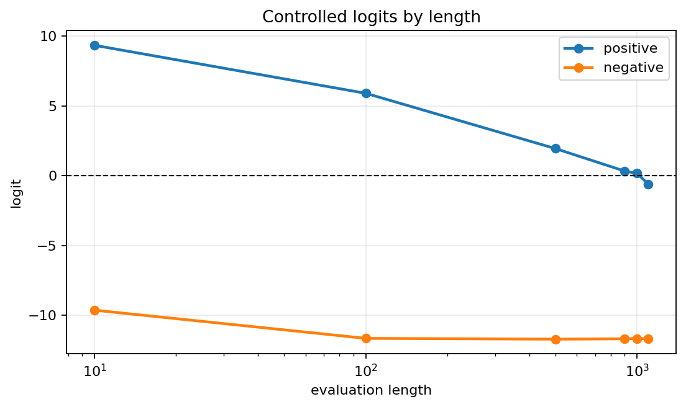
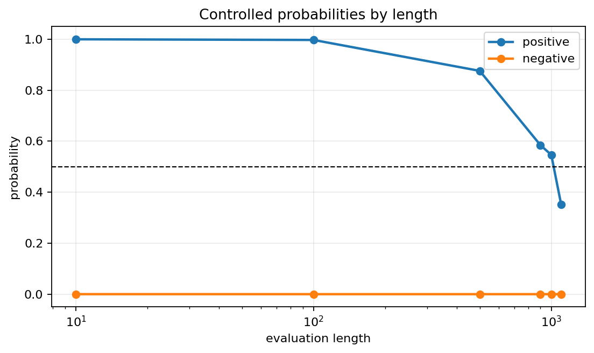
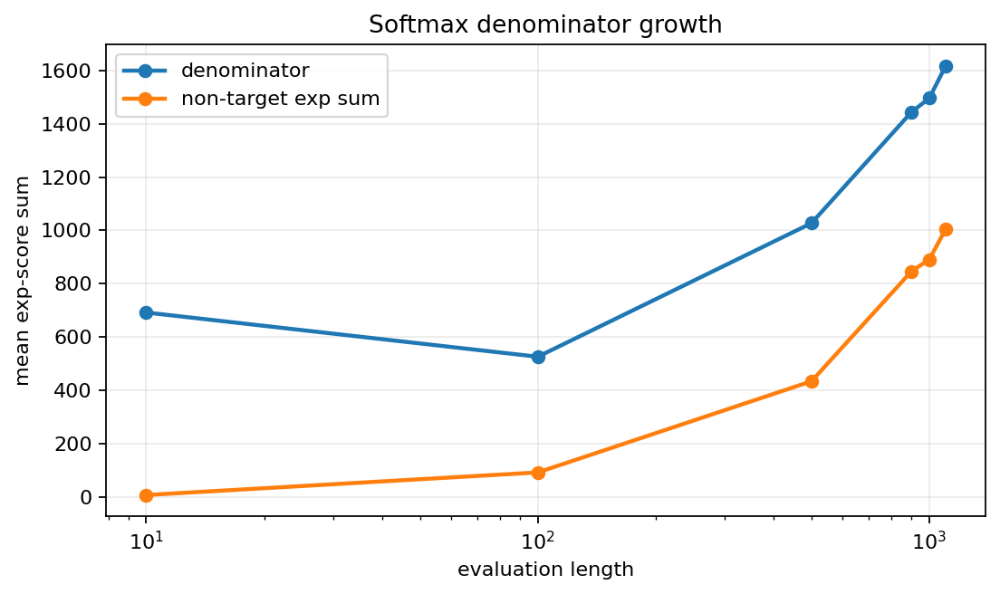
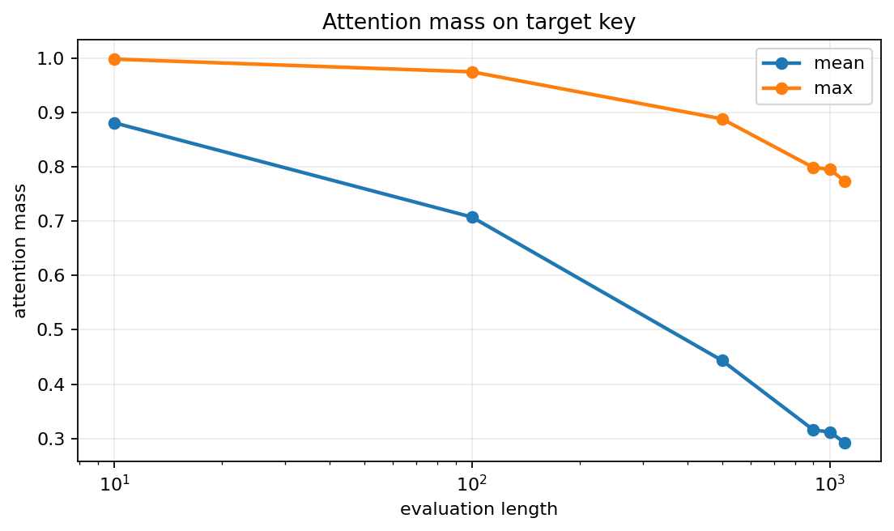
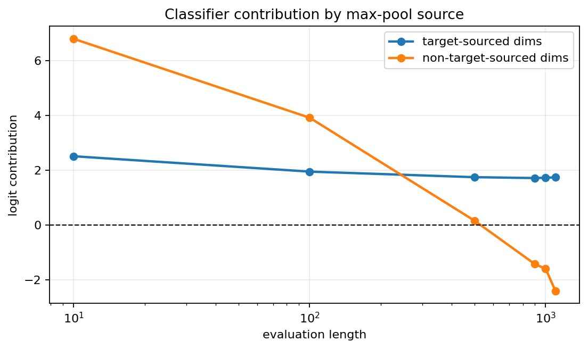
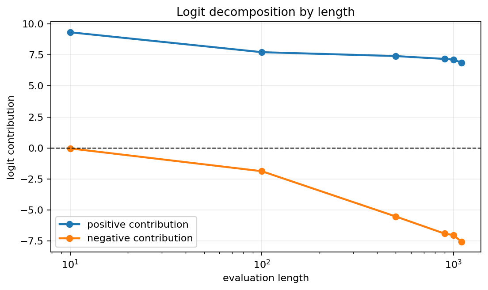

# Stage 1 Numerical Analysis

## Objective

This document summarizes the numerical analysis of why the Stage 1 transformer, trained only on length-10 sequences, fails on long exactly-one positive sequences.

The analyzed checkpoint is:

```text
runs/stage1_transformer_maxpool
```

The generated analysis files are in:

```text
runs/stage1_transformer_maxpool/numerical_analysis
```

## High-Level Finding

The Stage 1 model does not simply lose the target token completely. Instead, it learns a finite-margin target-detection mechanism that works at short lengths but degrades as sequence length increases.

The failure mechanism appears to combine two effects:

- target attention mass decreases because the attention softmax denominator grows with length
- max pooling increasingly admits non-target-sourced dimensions that contribute negatively to the final classifier logit

Together, these effects push the exactly-one positive logit below zero at long lengths.

## Positive Logit Collapse

For controlled exactly-one positive examples, the final logit decreases as length grows:

| Length | Logit | Probability | Prediction |
|---:|---:|---:|---:|
| 10 | 9.3538 | 0.9999 | positive |
| 100 | 5.9154 | 0.9973 | positive |
| 500 | 1.9553 | 0.8760 | positive |
| 900 | 0.3423 | 0.5847 | positive |
| 1000 | 0.1863 | 0.5464 | positive |
| 1100 | -0.6078 | 0.3526 | negative |





The model remains correct through length 1000 on this controlled example, but the margin is nearly gone. At length 1100, the logit crosses the zero decision boundary.

## Q/K/V Geometry

The target token has a large key and value norm:

| Token Type | Q Norm | K Norm | V Norm |
|---|---:|---:|---:|
| target token | 5.40 | 12.46 | 12.33 |
| typical non-target tokens | roughly 5.5-8.0 | roughly 4.4-7.5 | roughly 4.5-7.7 |

However, the target token is not mainly detected by its own query attending to itself. The target query to target key score is only about `0.60`. Several non-target query tokens score much more strongly against the target key:

| Query Token | Query-to-Target-Key Score |
|---:|---:|
| 7 | 8.20 |
| 9 | 6.99 |
| 13 | 6.72 |
| 5 | 6.55 |
| 6 | 6.43 |
| target token | 0.60 |

This suggests that the learned mechanism is not a clean target-position self-detector. Instead, certain non-target query types strongly attend to the target key and carry target information into their own hidden states.

## Attention Softmax Denominator

The target score stays high as length increases, but the sum of competing non-target exponentiated scores grows with length.

| Length | Target Score Mean | Non-Target Exp Sum Mean | Softmax Denominator Mean | Target Attention Mean |
|---:|---:|---:|---:|---:|
| 10 | 5.33 | 7.21 | 691.91 | 0.881 |
| 100 | 5.57 | 91.89 | 525.95 | 0.707 |
| 500 | 5.73 | 433.96 | 1027.17 | 0.444 |
| 900 | 5.73 | 846.35 | 1443.66 | 0.316 |
| 1000 | 5.75 | 891.04 | 1496.50 | 0.312 |
| 1100 | 5.74 | 1004.24 | 1616.47 | 0.293 |





The important point is that the target score itself does not collapse. The failure is not caused by the model suddenly assigning a low score to the target key. Rather, the finite target-score advantage is diluted by the growing number of non-target keys.

This matches the expected length-scaling issue:

```text
target_mass = exp(target_score) / sum_j exp(score_j)
```

As length increases, the denominator grows unless the target score advantage also grows. The learned Stage 1 mechanism does not create a length-scaling score advantage.

If the target score were overwhelmingly larger than every non-target score, attention dilution would not be a serious problem. The relevant condition is not merely:

```text
target_score > typical_non_target_score
```

Instead, the target exponentiated score must dominate the entire non-target sum:

```text
exp(target_score) >> sum_non_target exp(non_target_score)
```

For a rough intuition, if non-target scores are similar to each other, preserving a fixed target attention mass requires the target score margin to grow approximately like:

```text
target_score - typical_non_target_score ~= log(length)
```

Length-10 training does not strongly pressure the model to learn such a large margin. A finite margin is enough to solve the training distribution with near-zero loss, but the same margin becomes insufficient at lengths such as 500, 1000, or 1100. Since the attention score is computed from fixed token representations and weights,

```text
score(i, j) = dot(q_i, k_j) / sqrt(d_head)
```

the model has no built-in mechanism that automatically increases the target score as evaluation length grows.

## Query-Specific Attention

The last query token is not a reliable explanation for this model's behavior. This matters because the current classifier does not use the last token representation. It uses max pooling across all sequence positions.

Examples:

| Length | Query | Target Attention |
|---:|---|---:|
| 500 | last query | 0.741 |
| 1000 | last query | 0.041 |
| 1100 | last query | 0.103 |
| 1100 | max-target-attention query | 0.774 |

The length-1000 controlled example is still classified positive even though the last query barely attends to the target. Conversely, length 1100 has a higher last-query target attention than length 1000 but is classified negative.

Therefore, for the current max-pooling encoder classifier, the more relevant question is:

```text
Which positions and dimensions carry target evidence into the max-pooled vector?
```

## Hidden-State Evidence

Classifier-aligned evidence was computed as:

```text
evidence_i = dot(hidden_i, classifier_weight)
```

After the full transformer block, the target position itself is not the main positive carrier at long lengths:

| Length | Encoded Target Evidence | Encoded Non-Target Evidence Mean | Encoded Non-Target Evidence Max |
|---:|---:|---:|---:|
| 10 | 4.99 | 7.17 | 7.25 |
| 100 | -1.50 | 6.04 | 7.22 |
| 500 | -2.65 | 3.23 | 7.17 |
| 900 | -2.79 | 1.08 | 7.09 |
| 1000 | -2.74 | 0.96 | 7.08 |
| 1100 | -2.70 | 0.40 | 7.06 |

This shows that the positive decision is not simply driven by the final representation at the target position. Target information is distributed through attention into other positions, and max pooling selects dimensions from multiple positions.

## Max-Pool Source Attribution

The classifier uses max pooling:

```text
pooled[d] = max_i hidden[i, d]
```

The target-sourced contribution remains fairly stable from length 500 onward, but non-target-sourced contribution becomes increasingly negative:

| Length | Target-Sourced Contribution | Non-Target-Sourced Contribution | Final Logit |
|---:|---:|---:|---:|
| 10 | 2.50 | 6.79 | 9.35 |
| 100 | 1.94 | 3.91 | 5.92 |
| 500 | 1.74 | 0.15 | 1.96 |
| 900 | 1.71 | -1.43 | 0.34 |
| 1000 | 1.72 | -1.60 | 0.19 |
| 1100 | 1.73 | -2.41 | -0.61 |



This is the most direct numerical explanation of the final failure. The target signal is still present, but the max-pooled vector also includes non-target-sourced dimensions that increasingly push the classifier logit downward.

## Logit Decomposition

The final classifier logit is:

```text
logit = dot(classifier_weight, pooled) + classifier_bias
```

The classifier bias is small, approximately `0.064`. The decision is dominated by the pooled-vector contributions.

| Length | Positive Contribution Sum | Negative Contribution Sum | Logit |
|---:|---:|---:|---:|
| 10 | 9.32 | -0.03 | 9.35 |
| 100 | 7.72 | -1.87 | 5.92 |
| 500 | 7.41 | -5.52 | 1.96 |
| 900 | 7.18 | -6.90 | 0.34 |
| 1000 | 7.13 | -7.01 | 0.19 |
| 1100 | 6.87 | -7.55 | -0.61 |



Positive contributions decline slowly, while negative contributions grow substantially. The length-1100 failure occurs when the negative contribution outweighs the remaining positive contribution.

## Mechanistic Interpretation

The Stage 1 model learns a useful but length-fragile mechanism:

1. The target token gets a strong key and value representation.
2. Certain non-target query tokens attend strongly to the target key.
3. This creates positive evidence at short lengths.
4. As length increases, the attention softmax denominator grows.
5. Target attention mass decreases even though target scores remain high.
6. The target signal remains partially present, but max pooling increasingly selects non-target-sourced dimensions.
7. These non-target-sourced pooled dimensions contribute more negative evidence to the classifier.
8. The positive logit margin shrinks and eventually crosses below zero.

## Conclusion

The Stage 1 model does not learn a true length-invariant boolean OR algorithm. It learns a finite-margin target-detection mechanism that works on short sequences but is vulnerable to length scaling.

The failure is not caused by a single step. It is a composition of:

- finite Q/K target-score advantage
- softmax denominator growth with length
- decreasing target attention mass
- max-pool source shift toward harmful non-target dimensions
- increasing negative classifier contribution

This explains why the model can solve length-10 training data while failing on long exactly-one positive examples.
