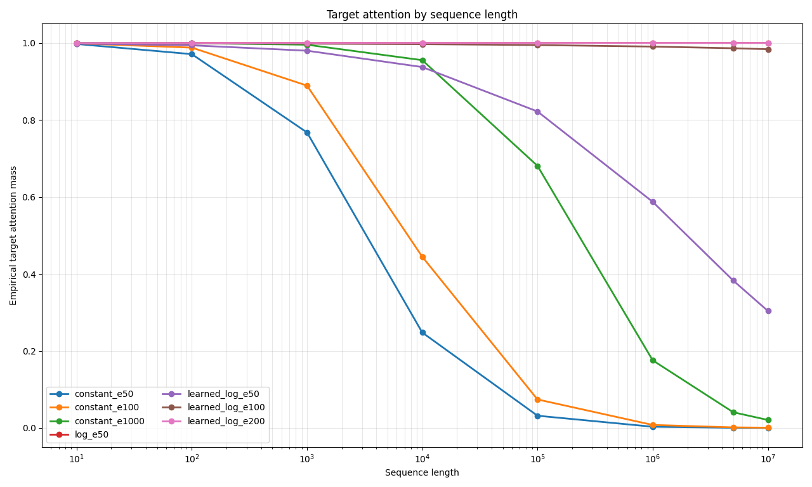
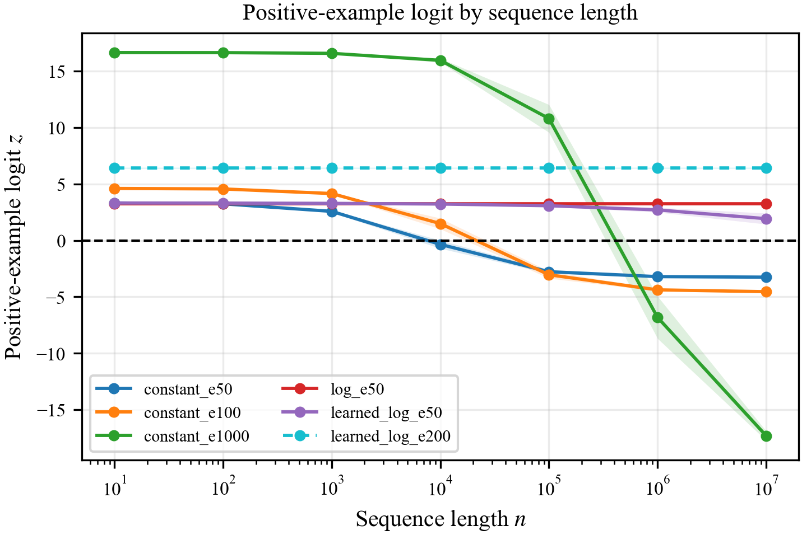

# When Does Length-Aware Attention Generalize in a Reduced Binary Classifier?

## Abstract

_jmac Don't use so much detailed technical notation and definitions in the abstract. Try to describe the conclusion and findings in prose rather than symbols and formulas. jmac_ 
Softmax attention classifiers trained on short sequences can fail to generalize to much longer sequences, even on simple target-token detection tasks. This report studies that failure mode in a deliberately reduced binary attention classifier. The model sees sequences containing either one target token or only non-target tokens, and a single final query attends over the sequence before a binary classifier makes the prediction. We compare constant, fixed-log, and learned-log score multipliers to test when length-aware attention scaling overcomes the growing softmax denominator. Let $\Delta$ denote the score margin between the target and non-target tokens, and let $c$ denote the learned coefficient in the learned-log multiplier. The trained model satisfies the two-score assumption: one target score and one shared non-target score. Therefore, the closed-form target-attention equation accurately describes the learned model. The experiments show three regimes. A constant multiplier improves with more training but fails asymptotically. A fixed-log multiplier succeeds when $\Delta>1$. A learned-log multiplier succeeds only after optimization pushes the effective product $c\Delta$ above 1. Thus, passing a finite long-sequence evaluation is not sufficient evidence of infinite-length _jmac We may want to refer to unbounded length rather than infinite length jmac_ generalization; the effective margin must grow faster than the softmax
denominator.

## Introduction

Length generalization is a basic difficulty for sequence models. A classifier can fit short training sequences while relying on a mechanism that does not remain valid at longer sequence lengths. This problem appears even in simple existential target-token tasks, where the model only needs to decide whether a sequence contains a particular token.

The motivating failure mode is attention dilution. Softmax attention divides a fixed budget of attention among all tokens, so a single target token must compete with a crowd of non-targets that grows with the sequence; even a fixed per-token margin for the target can be overwhelmed once that crowd is large enough. This raises a simple question: can attention be made length-aware, sharpening as the sequence grows, so that the target keeps enough attention at long lengths?

This report focuses on a reduced binary classifier proposed for that question. The model is intentionally much simpler than a full transformer. It uses fixed one-hot token values, learned query and key projections, a single readout query, and a binary classifier. The goal is not to show that this model is a competitive architecture. The goal is to test whether the simplified closed-form attention theory correctly describes a trainable model in the controlled setting where its assumptions can be directly checked.

The reduced model is built so that this theory applies exactly rather than approximately. Because every non-target token is identical, the attention scores collapse by construction to just two values, a target score and a shared non-target score. This two-score structure is precisely what the theory assumes, and it makes a closed-form expression for the target's attention mass exact, reducing length generalization to a precise question about how the target's score margin must grow with length.

The report compares three scaling rules that govern how fast attention sharpens as the sequence grows: constant, logarithmic, and learned. The experiments play out as the theory predicts. Constant scaling improves with more training but always fails eventually. Log scaling succeeds once the score margin the model learns exceeds 1. Learned-log scaling succeeds at unbounded length only when optimization drives the product of the learned coefficient and the score margin above 1. This last regime carries the report's main lesson: a model can pass a finite benchmark, such as sequences of ten million tokens, yet still be predicted to fail at larger lengths whenever that product, which the benchmark alone cannot reveal, stays below 1. Passing a fixed length is therefore not evidence of unbounded-length generalization; the target's effective margin must grow faster than the competing crowd.

## Related Work

This report describes the output of an independent research project in the Deep Network Understanding (DNU) Lab of Dickinson College. By design, DNU Lab projects focus on conducting research rather than surveying existing work. In this section, we describe two pieces of related work. This serves as an initial step toward a more complete literature survey.

The transformer architecture of Vaswani et al. places softmax attention at its center. Each query forms a normalized distribution over the keys, so a fixed total attention mass is shared among all of them, and the attention given to any one token depends on how many keys it competes with. When the number of non-target keys grows with sequence length, this normalization is exactly the dilution effect studied here. The present report isolates that effect in a minimal setting where the attention scores and output values can be read off directly.

Press et al. study length extrapolation directly and propose attention with linear biases (ALiBi), which adds a fixed, distance-dependent penalty to the attention scores so that a model trained on short sequences can be evaluated on much longer ones. Their method operates in a full transformer and supplies a recency bias in place of standard positional encodings. The present report is narrower and more analytical. Rather than proposing a transformer method, it studies a length-aware multiplier on the scores, an inverse temperature that may be held fixed or learned, in a reduced classifier where the condition for length generalization can be derived in closed form and the learned score geometry can be inspected directly.

## Background: Simplified Binary Attention

This section derives, from the model definition, the score structure and
closed-form target-attention mass previewed in the Introduction, and then uses
that closed form to characterize when the classifier generalizes to unbounded
length.

The task uses a two-token vocabulary:

- $t$: target token
- $u$: non-target token

A positive length-$n$ sequence, with $n\geq2$, contains one target token and
$n-1$ non-target tokens. The token in the last position is always the
non-target token $u$. The model has
no positional encoding, so permuting the tokens among the first $n-1$ positions
does not change its output. We place the target in the first position only to
make the notation easier to read; any position other than the last is
equivalent.

```text
t, u, u, ..., u
```

A negative length-$n$ sequence contains only non-target tokens:

```text
u, u, u, ..., u
```

At a high level, the query at the last position (the readout query) scores every token in the
sequence, softmax converts those scores into attention weights, and the
weighted sum of the token values is passed to a binary classifier.

The model begins with fixed one-hot embeddings for $t$ and $u$:

```math
t \mapsto [1,0],
\qquad
u \mapsto [0,1].
```

A length-$n$ sequence is thus represented by a one-hot matrix
$X\in\mathbb{R}^{n\times2}$ with one token embedding per row. The learned query
and key projections are $Q=XW_Q$ and $K=XW_K$ with
$W_Q,W_K\in\mathbb{R}^{2\times d}$, so $Q,K\in\mathbb{R}^{n\times d}$ and
$q_{\mathrm{last}}$ is the last row of $Q$. Here $d$ is the query and key
dimension. Conventional self-attention
forms the full $n\times n$ score matrix $QK^\top/\sqrt d$. This reduced
classifier uses only the query at the last position and therefore needs only
its scores against the $n$ keys:

```math
s_j=\frac{q_{\mathrm{last}}^\top k_j}{\sqrt d},
\qquad j=1,\ldots,n.
```

Since the token in the last position is $u$, $q_{\mathrm{last}}=q_u$ for every
example. Writing $k_t$ and $k_u$ for the target and non-target keys, which are
position-independent, the target and non-target scores are

```math
a=\frac{q_u^\top k_t}{\sqrt d},
\qquad
b=\frac{q_u^\top k_u}{\sqrt d}.
```

The architecture thus fixes the score vector of a positive example to the two-score structure

```math
S_n=(a,b,b,\ldots,b),
```

while training determines only the two values $a$ and $b$. Because there is a
single non-target type, every non-target position holds the same token, hence
the same key and the same score $b$ by construction. Define the score 
margin as

```math
\Delta=a-b.
```

The central change in this study is an additional score multiplier
$\alpha(n)$ applied before softmax. The attention weight on position $j$ is

```math
A_j
=
\frac{e^{\alpha(n)s_j}}
{\sum_{i=1}^{n}e^{\alpha(n)s_i}}.
```

Since $\alpha(n)$ multiplies the scores inside the softmax, it acts as a
length-dependent inverse temperature: larger $\alpha(n)$ sharpens the attention.
Standard attention corresponds to $\alpha(n)=1$. The
length-aware variants instead make $\alpha(n)$ grow with the sequence length. We
consider three choices of $\alpha(n)$ — constant, logarithmic, and learned
logarithmic — and analyze each in turn below.

For the positive score vector $S_n=(a,b,\ldots,b)$, the attention mass on the
single target key is

```math
p_t(n)
=
\frac{e^{\alpha(n)a}}
{e^{\alpha(n)a}+(n-1)e^{\alpha(n)b}}.
```

Dividing the numerator and denominator by $e^{\alpha(n)b}$ gives the closed
form

```math
p_t(n)
=
\frac{e^{\alpha(n)\Delta}}
{e^{\alpha(n)\Delta}+(n-1)}.
```

The value pathway reuses these one-hot embeddings directly as value vectors,
with no learned value projection, so the value vector $v_j$ at position $j$ is
$[1,0]$ when its token is the target and $[0,1]$ otherwise. This makes the
output directly record how much total attention is assigned to each token type.
The classifier reads the weighted sum of these value vectors:

```math
o(n)=\sum_{j=1}^{n} A_j v_j.
```

On a positive example, the target carries weight $p_t(n)$ and the non-targets
together carry the remaining $1-p_t(n)$, so the output is a convex combination
of the two value vectors:

```math
o_{\text{pos}}(n)
=
p_t(n)\,[1,0]+\big(1-p_t(n)\big)\,[0,1]
=
\big(p_t(n),\,1-p_t(n)\big).
```

A negative example contains only $u$, so its output is always

```math
o_{\text{neg}}(n)=[0,1].
```

The negative output is this same combination with target mass $0$, so both
outputs are fixed by the single scalar $p_t(n)$. A learned linear layer reads
this output, so on a positive example the classifier produces the logit

```math
z(n)=w_t\,p_t(n)+w_u\big(1-p_t(n)\big)+\beta=(w_t-w_u)\,p_t(n)+(w_u+\beta),
```

with learned weights $w_t,w_u$ and bias $\beta$, and predicts target-present when
$z(n)\geq0$. Since the slope $w_t-w_u$ is positive in the trained model, the logit increases
with $p_t(n)$, so classification reduces to a threshold: the model predicts
target-present when $p_t(n)\geq p^{\ast}$, with $p^{\ast}=-(w_u+\beta)/(w_t-w_u)$. If $p_t(n)\to0$, the positive representation converges to
the negative representation, and the representation gap between the two
classes vanishes. If $p_t(n)$ converges to a constant strictly between 0 and 1,
classification depends on this threshold. The
stronger, target-dominant outcome is $p_t(n)\to1$. The conditions below
distinguish these three cases.

### Length-Scaling Regimes

Assume that $\Delta>0$, so the target has a score advantage over each
non-target. If $\Delta\leq0$, none of the multipliers considered below can create such an
advantage, since each $\alpha(n)$ is positive and scales $\Delta$ without
changing its sign. The competing term $(n-1)$ is the source of
length dependence: it grows like $n$, so the target term $e^{\alpha(n)\Delta}$
must grow at least as fast for target attention to survive. A logarithmic
$\alpha(n)$ is the natural way to achieve this, since it turns
$e^{\alpha(n)\Delta}$ into a power of $n$.

For the constant baseline $\alpha(n)=1$,

```math
p_t(n)
=
\frac{e^\Delta}{e^\Delta+(n-1)}
\to 0
\qquad
\text{as } n\to\infty.
```

A fixed score margin can beat each non-target token individually, but it cannot beat
an unbounded number of non-target competitors. Consequently,
$o_{\text{pos}}(n)\to[0,1]$, the same representation as
$o_{\text{neg}}(n)$.

For the log multiplier $\alpha(n)=\log n$, we have
$e^{\alpha(n)\Delta}=e^{\Delta\log n}=n^\Delta$, so

```math
p_t(n)
=
\frac{n^\Delta}{n^\Delta+n-1}.
```

The limit depends on the score margin:

```math
\lim_{n\to\infty}p_t(n)
=
\begin{cases}
1, & \Delta>1,\\
\tfrac12, & \Delta=1,\\
0, & 0<\Delta<1.
\end{cases}
```

Thus $\Delta>1$ makes target attention converge to 1, while $0<\Delta<1$ causes
the positive representation to collapse onto the negative representation. At the
boundary $\Delta=1$, the two representations remain distinct, and classification
depends on the learned decision boundary.

For the learned-log multiplier used in the experiments,

```math
\alpha(n)=1+c\log(1+n),
```

where $c$ is a learned, strictly positive coefficient. The additive $1$ makes
$\alpha=1$ at $c=0$, recovering the constant baseline, and using $\log(1+n)$
keeps the multiplier well-defined at small $n$; neither term changes the
asymptotic exponent, which is governed by $c\Delta$. Since
$e^{\alpha(n)\Delta}=e^\Delta(1+n)^{c\Delta}$, the target attention mass is

```math
p_t(n)
=
\frac{e^\Delta(1+n)^{c\Delta}}
{e^\Delta(1+n)^{c\Delta}+(n-1)}.
```

Its limit is

```math
\lim_{n\to\infty}p_t(n)
=
\begin{cases}
1, & c\Delta>1,\\
\dfrac{e^\Delta}{e^\Delta+1}, & c\Delta=1,\\
0, & c\Delta<1.
\end{cases}
```

Thus $c\Delta>1$ makes target attention converge to 1. The equality case again
has a nonzero limiting target mass and depends on the classifier's decision
boundary, whereas $c\Delta<1$ produces asymptotic collapse.

A single condition unifies all three regimes. Writing the target attention mass
as

```math
p_t(n)
=
\frac{1}
{1+\exp\!\left(\log(n-1)-\alpha(n)\Delta\right)}
=
\sigma\big(g(n)\big),
\qquad
g(n)=\alpha(n)\Delta-\log(n-1),
```

with $\sigma$ the sigmoid function, target attention converges to 1 exactly
when $g(n)\to+\infty$, that is, when the effective margin $\alpha(n)\Delta$ (the score margin amplified by the multiplier) outgrows
$\log(n-1)$ without bound. Since $\log(n-1)$ grows like $\log n$ with
coefficient 1, the outcome is decided by how fast $\alpha(n)\Delta$ grows: it
stays bounded for the constant baseline, so target attention always collapses,
and grows like $\Delta\log n$ for the log multiplier and $c\Delta\log n$ for the
learned-log multiplier. Target dominance therefore needs the coefficient of
$\log n$ to exceed 1, giving the thresholds $\Delta>1$ and $c\Delta>1$. This is
the precise sense in which length generalization requires the effective margin
to grow faster than the softmax denominator.

## Experimental Design

The experiments train the reduced model derived above — fixed one-hot
embeddings reused as value vectors, learned query and key projections
$W_Q,W_K\in\mathbb{R}^{2\times2}$, a readout query, softmax attention, and a
binary classifier on the two-dimensional attention output — and vary the
score multiplier $\alpha(n)$ across three modes:

| Mode | $\alpha(n)$ |
|---|---|
| `constant` | $1$ |
| `log` | $\log n$ |
| `learned_log` | $1+c\log(1+n)$ |

For `learned_log`, the coefficient is $c=\mathrm{softplus}(k_\alpha)$, where
$k_\alpha$ is an unconstrained learnable scalar, so $c$ stays positive during
optimization.

The classifier maps the attention output to the logit $z(n)$ introduced
above; an example is classified target-present when $z(n)\geq0$, equivalently
when its sigmoid probability is at least 0.5. Two quantities from the classifier
appear in the results: the positive-example logit, the value of $z(n)$ on a
positive example, whose sign decides whether that example is classified
correctly; and the positive-example accuracy (equivalently, recall), the
fraction of positive examples with $z(n)\geq0$.

Each run trains at length 10 on 2000 examples split evenly between positive and
negative, minimizing binary cross-entropy on the logit with AdamW (learning rate
$3\times10^{-3}$, no weight decay, batch size 64). One epoch is a single pass over the 2000 examples, or 32 optimizer
steps. Each configuration is trained
under five random seeds (0-4), and all reported numbers are the mean and
standard deviation across these seeds.

Each trained model is evaluated at the seven powers of ten from $10$ to $10^7$,
on 50 balanced examples per length. Because a
length-$10^7$ evaluation cannot be held in memory at once, examples are
generated and scored in small chunks, so the full evaluation tensor is never
materialized.

Each run is labeled by its multiplier mode and epoch budget: for example,
`constant_e50` is constant scaling trained for 50 epochs and `learned_log_e200`
is learned-log scaling trained for 200 epochs. We analyze constant runs at 50,
100, and 1000 epochs; one log run at 50 epochs; and learned-log runs at 50, 100, 200,
and 400 epochs. These labels index the rows of Table 1, which lists all eight
runs. The figures below show a representative six: every constant budget (to
trace the failure point moving outward), the log run, and the two learned-log
budgets that bracket the $c\Delta=1$ threshold, `learned_log_e50` below and
`learned_log_e200` above. The omitted `learned_log_e100` and `learned_log_e400`
sit on the same sides and behave accordingly.

## Results

In this task, length generalization is decided entirely by the positive examples. A negative sequence contains only non-target values, so the attention output stays in the non-target direction no matter how attention is spread across positions, and negatives are classified correctly in every analyzed run at every length. The difficulty lives in the positive examples: the target mass $p_t$ can dilute with length until the classifier no longer detects the target. Table 1 reports each run at $10^7$, and Figures 1 and 2 trace the target mass $p_t$ and the positive-example logit across length.

**Table 1:** Main results at $n=10^7$, as means over five seeds
(± one standard deviation). Negative accuracy is 100% in every run.

| Run | Steps | $\Delta$ | $c$ | $c\Delta$ | $p_t$ | Positive-example logit | Positive-example accuracy |
|---|---:|---:|---:|---:|---:|---:|---:|
| `constant_e50` | 1600 | 9.0 ± 0.2 | n/a | n/a | 0.001 ± 0.000 | -3.3 ± 0.1 | 0% |
| `constant_e100` | 3200 | 9.9 ± 0.2 | n/a | n/a | 0.002 ± 0.000 | -4.5 ± 0.1 | 0% |
| `constant_e1000` | 32000 | 13.2 ± 0.2 | n/a | n/a | 0.050 ± 0.010 | -17.3 ± 0.4 | 0% |
| `log_e50` | 1600 | 4.4 ± 0.1 | n/a | n/a | 1.000 ± 0.000 | 3.2 ± 0.1 | 100% |
| `learned_log_e50` | 1600 | 8.1 ± 0.2 | 0.072 ± 0.006 | 0.58 ± 0.03 | 0.788 ± 0.075 | 1.9 ± 0.5 | 100% |
| `learned_log_e100` | 3200 | 8.6 ± 0.3 | 0.096 ± 0.008 | 0.83 ± 0.05 | 0.997 ± 0.002 | 4.6 ± 0.1 | 100% |
| `learned_log_e200` | 6400 | 9.0 ± 0.3 | 0.126 ± 0.010 | 1.14 ± 0.06 | 1.000 ± 0.000 | 6.4 ± 0.1 | 100% |
| `learned_log_e400` | 12800 | 9.4 ± 0.3 | 0.166 ± 0.013 | 1.55 ± 0.08 | 1.000 ± 0.000 | 9.6 ± 0.1 | 100% |



**Figure 1:** Target attention mass versus sequence length for six representative runs (mean over five seeds; shaded bands ±1 s.d.). Runs that generalize saturate at $p_t=1$ and coincide here (`log_e50` and `learned_log_e200` overlap, the latter dashed); Figure 2 separates them by positive-example logit.



**Figure 2:** Positive-example logit versus sequence length for the same six runs (mean over five seeds; shaded bands ±1 s.d.; the horizontal dashed line at $z=0$ marks the decision boundary).

### Constant Scaling

Constant scaling uses $\alpha=1$. At any fixed $\Delta$ this gives $p_t(n)\to0$. Empirically, more training increases $\Delta$, moving the failure point outward without changing this asymptotic regime: the positive-example accuracy at $10^7$ is 0 for all three budgets in every seed. More training even drives the positive-example logit more negative, not less (Table 1: $-3.3$, $-4.5$, $-17.3$ for e50, e100, e1000): once the target mass has collapsed, the logit is set by the learned intercept $w_u+\beta$ (the negative-example logit), which itself grows more negative with training. The larger margin only postpones the collapse; the theory still predicts failure for any finite fixed margin.

### Log Scaling

Log scaling uses $\alpha=\log n$. The score margin is $\Delta=4.4\pm0.1$, comfortably above the threshold $\Delta>1$ in every seed, so the theory predicts $p_t(n)\to1$, which is what is observed: target attention reaches 1.000 at long lengths, the positive-example logit stays positive, and the positive-example accuracy is 1 at $10^7$ in all five seeds.

### Learned Log Scaling

Learned-log scaling uses $\alpha=1+c\log(1+n)$. These runs separate finite-length success from asymptotic success. At 50 and 100 epochs the model already passes the $10^7$ benchmark, with positive-example accuracy 1 in all five seeds, yet its exponent stays below the threshold, $c\Delta=0.58\pm0.03$ and $0.83\pm0.05$ respectively, so the theory predicts eventual failure at larger lengths. Solving the closed-form $p_t(n)$ for the length at which target attention drops to the classifier's per-seed decision threshold $p^{\ast}$ quantifies this (derivation in Appendix A): across seeds, the 50-epoch runs ($c\Delta\approx0.58$) are predicted to fail near $n\sim10^{8}$–$10^{9}$, only one to two orders of magnitude past the benchmark. The 100-epoch runs ($c\Delta\approx0.83$) are pushed beyond $n\sim10^{18}$, the failure length climbing steeply as $c\Delta\to1$.

Only at 200 epochs does $c\Delta$ exceed 1 in every seed ($1.14\pm0.06$), entering the asymptotic-success regime; by 400 epochs it is well clear ($1.55\pm0.08$). The crossing is driven by the coefficient $c$, which grows monotonically with the training budget ($0.072\to0.096\to0.126\to0.166$) while the score margin $\Delta$ grows only modestly ($8.1\to8.6\to9.0\to9.4$).

The e50 and e100 budgets reach 100% at $10^7$ with $c\Delta<1$: passing at one length does not certify generalization to every length. The property that transfers is $c\Delta>1$, not accuracy at any single point.

## Mechanism: What the Model Learns

The reduced model also allows a direct weight-level explanation of where $\Delta$ comes from. Recall that the readout query is $q_u$ (the last token is always the non-target $u$), the target key is $k_t$, and the non-target key is $k_u$. The target and non-target scores are then

```math
a
=
\frac{q_u^\top k_t}{\sqrt d},
\qquad
b
=
\frac{q_u^\top k_u}{\sqrt d}.
```

The margin is therefore

```math
\Delta
=
a-b
=
\frac{q_u^\top(k_t-k_u)}{\sqrt d}.
```

For one `learned_log_e200` checkpoint (seed 1), the learned vectors are approximately

```math
q_u=
\begin{bmatrix}
-1.830\\
1.646
\end{bmatrix},
\qquad
k_t=
\begin{bmatrix}
-2.232\\
1.642
\end{bmatrix},
\qquad
k_u=
\begin{bmatrix}
1.990\\
-1.428
\end{bmatrix}.
```

With $d=2$, this gives

```math
a\approx4.799,
\qquad
b\approx-4.237,
\qquad
\Delta\approx9.036.
```


**Figure 3:** Learned query and key vectors for `learned_log_e200` (seed 1), drawn in the $d=2$ query/key space.

Geometrically (Figure 3), $q_u$ points in a direction that separates the target key from the non-target key. The target key has a positive projection along the readout query direction, while the non-target key has a negative projection. Equivalently, $q_u$ aligns with the difference vector $k_t-k_u$. This alignment creates the score pattern $a>b$, the positive margin $\Delta$ that the length-scaling analysis assumes.

The geometry is the same in every seed: across seeds 0-4 the target score $a$ is positive and the non-target score $b$ negative, $q_u$ is nearly collinear with $k_t-k_u$ (cosine $\geq0.99$), and $\Delta=9.03\pm0.28$.

This mechanism explains how the model creates a target advantage, but it also shows why a target advantage is not by itself enough. Under constant scaling, even a large fixed $\Delta$ is eventually overwhelmed by the growing number of non-target positions. Learned-log attention has an additional degree of freedom: it can increase the coefficient $c$ so that the effective margin grows like $c\Delta\log n$. In the successful learned-log run, optimization makes the product $c\Delta$ cross the threshold.

## Discussion

The main contribution of this report is a controlled analysis of length-aware
attention scaling in a trainable reduced model. The two-token,
position-independent construction makes the two-score structure expected by design;
it is not itself a learned discovery. This simplification lets us apply the
closed-form target-attention equation directly and isolate the effect of the
score multiplier from other transformer components.

The result also sharpens the distinction between finite and asymptotic generalization. A run can clear a fixed length such as $10^7$ while its exponent $c\Delta$ still sits below 1, so passing a benchmark certifies only finite-length behavior, not the limit. What survives to unbounded length is a structural property of the learned solution, $c\Delta>1$, and exposing that property cleanly, rather than a single-length benchmark score, is what the reduced model is for.

The reduced model is intentionally limited. It uses fixed semantic value vectors, no positional encodings, one readout query, and a simple binary classifier. These restrictions make the mechanism easy to analyze, but they also mean the conclusion should not be transferred directly to a full transformer, which can have non-identical non-target scores, learned value vectors, multiple heads, residual streams, feed-forward layers, layer normalization, and pooling. Any of these can break the exact two-score structure the analysis relies on.

The value of the reduced model is therefore diagnostic. It separates two questions that are entangled in a full transformer. First, can the architecture create a score margin $\Delta$? Second, does the length-scaling mechanism
make that margin grow fast enough to beat the softmax denominator? In this controlled binary setting, the answer to both questions can be measured directly.

Two directions follow. The first is to relax these restrictions toward a full transformer and test whether an analog of the $c\Delta>1$ condition still governs length generalization once non-identical non-target scores, learned values, and depth are reintroduced. The second is to move beyond binary detection to broader versions of the task, such as identifying which target type is present or counting how many targets occur.

## Conclusion

This report studied length generalization in a reduced binary attention classifier whose two-score structure makes the closed-form target-attention expression exact.

The experiments support three conclusions. Constant scaling is robust only up to a finite length that grows with training, but fails at any sufficiently large length. Log scaling succeeds when the score margin satisfies $\Delta>1$. Learned-log scaling succeeds asymptotically only when optimization pushes $c\Delta>1$. Therefore, in this reduced setting, the central condition for length generalization is not merely fitting the training length or passing a finite long-length benchmark. The effective margin must grow faster than the logarithm of the number of competing non-target keys.

## Appendix A: Additional Material To Add Later

The final version may include some of the following supporting material if space
allows:

- full $W_Q$ and $W_K$ matrices for the mechanism example
- a two-dimensional query-key vector plot for $q_u$, $k_t$, $k_u$, and
  $k_t-k_u$
- classifier threshold estimates for the constant runs
- the derivation of the predicted learned-log failure lengths, from solving the
  closed-form $p_t(n)$ at the classifier's decision threshold
- the multi-length training negative result as a short appendix
- a one-paragraph note that later Stage 4A and Stage 4B experiments extended the
  reduced framework beyond binary classification, while the main report focuses
  on the binary setting for clarity

## References

Ashish Vaswani, Noam Shazeer, Niki Parmar, Jakob Uszkoreit, Llion Jones, Aidan N. Gomez, Lukasz Kaiser, and Illia Polosukhin. 2017. Attention Is All You Need. In *Advances in Neural Information Processing Systems*.

Ofir Press, Noah A. Smith, and Mike Lewis. 2022. Train Short, Test Long: Attention with Linear Biases Enables Input Length Extrapolation. In *International Conference on Learning Representations*.
