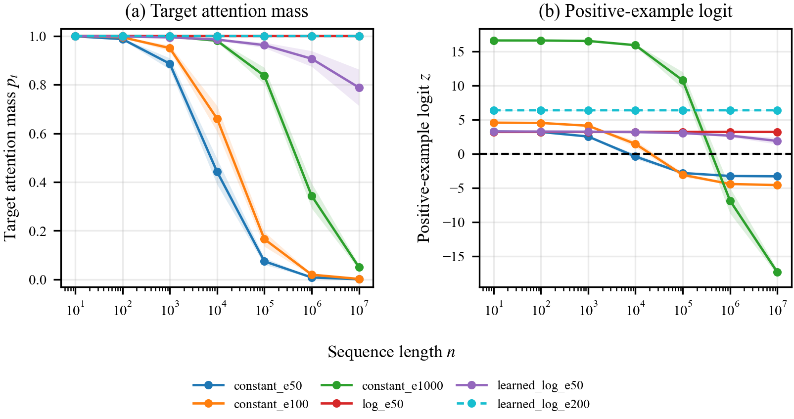
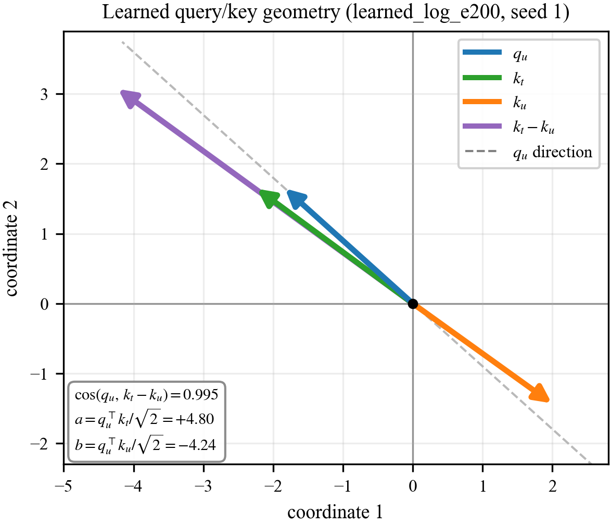

# When Does Length-Aware Attention Generalize in a Reduced Binary Classifier?

## Abstract

Softmax-attention classifiers trained on short sequences can fail at much longer lengths, even on a single-target detection task, because the target shares a fixed attention budget with a growing crowd of non-targets. We ask when length-aware attention overcomes this dilution in an exactly analyzable reduced binary classifier, where one readout query attends to one-hot token embeddings and identical non-targets yield a closed form for target attention. We compare constant, logarithmic, and learned logarithmic scaling. As sequences grow, the target eventually receives essentially all attention only when its unnormalized weight outgrows the non-targets' aggregate weight. Constant scaling never reaches this limit; logarithmic scaling does when the learned target score advantage is large enough; learned logarithmic scaling does when training makes amplification grow fast enough. Below the growth threshold, positive classification eventually fails; at equality, correctness depends on the learned decision threshold. A model may pass at ten million tokens yet be predicted to fail later: finite-length accuracy alone cannot establish unbounded-length behavior.

## Introduction

Length generalization is a basic difficulty for sequence models: a classifier can fit short training sequences using a mechanism that fails at longer lengths. The problem appears even in an existential target-token task, where the model only decides whether a sequence contains a particular token.

The motivating failure mode is attention dilution. Softmax attention divides a fixed budget of attention among all tokens, so a single target token must compete with a crowd of non-targets that grows with the sequence; even a fixed score advantage for the target over each non-target can be overwhelmed once that crowd is large enough. This raises a simple question: can attention be made length-aware, sharpening as the sequence grows, so that the target keeps enough attention at long lengths?

To answer this question, the report studies an intentionally reduced binary classifier with fixed one-hot token values, learned query and key projections, one readout query at the last position, and a linear classifier. Identical non-targets make their attention scores equal, exactly realizing the closed-form theory's two-score structure. The central intervention is a score multiplier controlling how sharply attention concentrates as length grows. The target-attention expression is therefore exact, allowing a controlled test of a trainable model with directly checkable assumptions; the aim is not to propose a competitive architecture.

Experiments across constant, logarithmic, and learned logarithmic scaling match the theory: constant scaling only postpones failure. With log scaling, a target score advantage above 1 makes the target receive essentially all attention at arbitrarily long lengths; learned-log does so once the product of its coefficient and this advantage exceeds 1. A run may still pass at ten million tokens when this product is below 1, although its learned parameters imply eventual failure. No finite benchmark establishes generalization to all lengths: unbounded-length behavior is determined by the target's unnormalized weight relative to the aggregate non-target weight and, at equality, by the learned threshold.

## Related Work

This report describes the output of an independent research project in the Deep Network Understanding (DNU) Lab of Dickinson College. Consistent with the lab's emphasis on original research, this report relates its contribution to a small number of representative works rather than surveying the field comprehensively. We discuss two such works below, chosen for their direct connection to the mechanism studied here, and leave a fuller literature review to future work.

The transformer architecture of Vaswani et al. places softmax attention at its center. Each query forms a normalized distribution over the keys, so a fixed total attention mass is shared among all of them, and the attention given to any one token depends on how many keys it competes with. When the number of non-target keys grows with sequence length, this normalization is exactly the dilution effect studied here. The present report isolates that effect in a minimal setting where the attention scores and output values can be read off directly.

Press et al. study length extrapolation directly and propose attention with linear biases (ALiBi), which adds a fixed, distance-dependent penalty to the attention scores so that a model trained on short sequences can be evaluated on much longer ones. Their method operates in a full transformer and supplies a recency bias in place of standard positional encodings. The present report is narrower and more analytical. Rather than proposing a transformer method, it studies a length-aware multiplier on the scores, an inverse temperature that may be held fixed or learned, in a reduced classifier where the condition for length generalization can be derived in closed form and the learned score geometry can be inspected directly.

## Background: Reduced Binary Attention

This section derives the model's two-score structure and the closed-form
target-attention mass previewed in the Introduction, then characterizes its
unbounded-length behavior.

The task uses a two-token vocabulary:

- $t$: target token
- $u$: non-target token

A positive length-$n$ sequence, with $n\geq2$, contains one target token and
$n-1$ non-target tokens. The token in the last position is always the
non-target token $u$. Because both positive and negative sequences end in $u$, this position carries no label information; it simply fixes a consistent readout slot. The model has
no positional encoding, so permuting the tokens among the first $n-1$ positions
does not change its output. We place the target in the first position only to
make the notation easier to read; any position other than the last is
equivalent.

```text
t, u, u, ..., u
```

A negative length-$n$ sequence contains only non-target tokens:

```text
u, u, u, ..., u
```

At a high level, the query at the last position (the readout query) scores every token in the
sequence, softmax converts those scores into attention weights, and the
weighted sum of the token values is passed to a binary classifier.

The model begins with fixed one-hot embeddings for $t$ and $u$:

```math
t \mapsto [1,0],
\qquad
u \mapsto [0,1].
```

A length-$n$ sequence is thus represented by a one-hot matrix
$X\in\mathbb{R}^{n\times2}$ with one token embedding per row. The learned query
and key projections are $Q=XW_Q$ and $K=XW_K$ with
$W_Q,W_K\in\mathbb{R}^{2\times d}$, so $Q,K\in\mathbb{R}^{n\times d}$. Let
$q_i,k_i\in\mathbb{R}^d$ denote column vectors whose transposes are the
corresponding rows of $Q$ and $K$: $q_i^\top=Q_{i,:}$ and
$k_i^\top=K_{i,:}$. We write $q_{\mathrm{last}}=q_n$. Here $d$ is the query and
key dimension, set to $d=2$ throughout. Conventional self-attention forms the
full $n\times n$ score matrix $QK^\top/\sqrt d$, whose $(i,j)$ entry is
$q_i^\top k_j/\sqrt d$. This reduced classifier uses only the query at the last
position and therefore needs only its scores against the $n$ keys:

```math
s_j=\frac{q_{\mathrm{last}}^\top k_j}{\sqrt d},
\qquad j=1,\ldots,n.
```

Because the embeddings are one-hot, they select the corresponding rows of the
projection matrices:

```math
q_u^\top=[0,1]W_Q,
\qquad
k_t^\top=[1,0]W_K,
\qquad
k_u^\top=[0,1]W_K.
```

These token-specific vectors are position-independent. Since the token in the
last position is $u$, $q_{\mathrm{last}}=q_u$ for every example. The target and
non-target scores, and the score margin between them, are

```math
a=\frac{q_u^\top k_t}{\sqrt d},
\qquad
b=\frac{q_u^\top k_u}{\sqrt d},
\qquad
\Delta=a-b.
```

A positive example therefore has the two-score vector

```math
S_n=(a,b,b,\ldots,b),
```

where training determines $a$ and $b$, while identical non-target tokens force
every remaining entry to equal $b$.

The central change in this study is an additional score multiplier
$\alpha(n)$ applied before softmax. The attention weight on position $j$ is

```math
A_j
=
\frac{e^{\alpha(n)s_j}}
{\sum_{i=1}^{n}e^{\alpha(n)s_i}}.
```

Since $\alpha(n)$ multiplies the scores inside the softmax, it acts as a
length-dependent inverse temperature: larger $\alpha(n)$ sharpens the attention.
Standard attention corresponds to $\alpha(n)=1$. The
length-aware variants instead make $\alpha(n)$ grow with the sequence length. We
consider three choices of $\alpha(n)$: constant, logarithmic, and learned
logarithmic. Each is analyzed in turn below.

For the positive score vector $S_n=(a,b,\ldots,b)$, the attention mass on the
single target key is

```math
p_t(n)
=
\frac{e^{\alpha(n)a}}
{e^{\alpha(n)a}+(n-1)e^{\alpha(n)b}}
=
\frac{e^{\alpha(n)\Delta}}
{e^{\alpha(n)\Delta}+(n-1)},
```

where the second form follows by dividing the numerator and denominator by
$e^{\alpha(n)b}$.

The value pathway reuses these one-hot embeddings directly as value vectors,
with no learned value projection, so the value vector $v_j$ at position $j$ is
$[1,0]$ when its token is the target and $[0,1]$ otherwise. This makes the
output directly record how much total attention is assigned to each token type.
The classifier reads the weighted sum of these value vectors:

```math
o(n)=\sum_{j=1}^{n} A_j v_j.
```

On a positive example, the target carries weight $p_t(n)$ and the non-targets
together carry the remaining $1-p_t(n)$, so the output is a convex combination
of the two value vectors:

```math
o_{\text{pos}}(n)
=
p_t(n)\,[1,0]+\big(1-p_t(n)\big)\,[0,1]
=
\big(p_t(n),\,1-p_t(n)\big).
```

A negative example contains only $u$, so its output is always

```math
o_{\text{neg}}(n)=[0,1].
```

The negative output is this same combination with target mass $0$, so both
outputs are fixed by the single scalar $p_t(n)$. A learned linear layer reads
this output, so on a positive example the classifier produces the logit

```math
z(n)=w_t\,p_t(n)+w_u\big(1-p_t(n)\big)+\beta=(w_t-w_u)\,p_t(n)+(w_u+\beta),
```

with learned weights $w_t,w_u$ and bias $\beta$, and predicts target-present when
$z(n)\geq0$. Since the slope $w_t-w_u$ is positive in the trained model, the logit increases
with $p_t(n)$, so classification reduces to a threshold: the model predicts
target-present when $p_t(n)\geq p^{\ast}$, with $p^{\ast}=-(w_u+\beta)/(w_t-w_u)$. If $p_t(n)\to0$, the positive representation converges to
the negative representation, and the representation gap between the two
classes vanishes. If $p_t(n)$ converges to a constant strictly between 0 and 1,
classification depends on this threshold. The
stronger outcome is $p_t(n)\to1$. The conditions below
distinguish these three cases.

### Length-Scaling Regimes

Assume that $\Delta>0$, so the target has a score advantage over each
non-target. If $\Delta\leq0$, none of the multipliers considered below can create such an
advantage, since each $\alpha(n)$ is positive and scales $\Delta$ without
changing its sign. The competing term $(n-1)$ is the source of
length dependence: it grows like $n$, so the target term $e^{\alpha(n)\Delta}$
must grow at least as fast for target attention to survive. A logarithmic
$\alpha(n)$ is the natural way to achieve this, since it turns
$e^{\alpha(n)\Delta}$ into a power of $n$.

For the constant baseline $\alpha(n)=1$,

```math
p_t(n)
=
\frac{e^\Delta}{e^\Delta+(n-1)}
\to 0
\qquad
\text{as } n\to\infty.
```

A fixed score margin can beat each non-target token individually, but it cannot beat
an unbounded number of non-target competitors. Consequently,
$o_{\text{pos}}(n)\to[0,1]$, the same representation as
$o_{\text{neg}}(n)$.

For the log multiplier $\alpha(n)=\log n$, we have
$e^{\alpha(n)\Delta}=e^{\Delta\log n}=n^\Delta$, so

```math
p_t(n)
=
\frac{n^\Delta}{n^\Delta+n-1}.
```

The limit depends on the score margin:

```math
\lim_{n\to\infty}p_t(n)
=
\begin{cases}
1, & \Delta>1,\\
\tfrac12, & \Delta=1,\\
0, & 0<\Delta<1.
\end{cases}
```

Thus $\Delta>1$ makes target attention converge to 1, while $0<\Delta<1$ causes
the positive representation to collapse onto the negative representation. At the
boundary $\Delta=1$, the two representations remain distinct, and classification
depends on the learned decision boundary.

For the learned-log multiplier used in the experiments,

```math
\alpha(n)=1+c\log(1+n),
```

where $c$ is a learned, strictly positive coefficient. In the formal limit
$c\to0$, $\alpha(n)\to1$, recovering the constant baseline. Using $\log(1+n)$
keeps the multiplier well-defined at small $n$; neither choice changes the
asymptotic exponent, which is governed by $c\Delta$. Since
$e^{\alpha(n)\Delta}=e^\Delta(1+n)^{c\Delta}$, the target attention mass is

```math
p_t(n)
=
\frac{e^\Delta(1+n)^{c\Delta}}
{e^\Delta(1+n)^{c\Delta}+(n-1)}.
```

Its limit is

```math
\lim_{n\to\infty}p_t(n)
=
\begin{cases}
1, & c\Delta>1,\\
\dfrac{e^\Delta}{e^\Delta+1}, & c\Delta=1,\\
0, & c\Delta<1.
\end{cases}
```

Thus $c\Delta>1$ makes target attention converge to 1. The equality case again
has a nonzero limiting target mass and depends on the classifier's decision
boundary, whereas $c\Delta<1$ produces asymptotic collapse.

A single condition unifies all three regimes. Writing the target attention mass
as

```math
p_t(n)
=
\frac{1}
{1+\exp\!\left(\log(n-1)-\alpha(n)\Delta\right)}
=
\sigma\big(g(n)\big),
\qquad
g(n)=\alpha(n)\Delta-\log(n-1),
```

with $\sigma$ the sigmoid function, target attention converges to 1 exactly
when $g(n)\to+\infty$, that is, when the effective margin $\alpha(n)\Delta$ outgrows
$\log(n-1)$ without bound. Since $\log(n-1)$ grows like $\log n$ with
coefficient 1, the outcome is decided by how fast $\alpha(n)\Delta$ grows: it
stays bounded for the constant baseline, so target attention always collapses,
and grows like $\Delta\log n$ for the log multiplier and $c\Delta\log n$ for the
learned-log multiplier. Thus $p_t(n)\to1$ exactly when the coefficient of
$\log n$ exceeds 1, giving the thresholds $\Delta>1$ and $c\Delta>1$.
Equivalently, the effective margin must grow faster than the logarithm of the
number of competing non-target keys.

## Experimental Design

We train the reduced model defined above and vary the score multiplier
$\alpha(n)$ across three modes:

```math
\begin{aligned}
\texttt{constant}:     && \alpha(n) &= 1,\\
\texttt{log}:          && \alpha(n) &= \log n,\\
\texttt{learned\_log}: && \alpha(n) &= 1+c\log(1+n).
\end{aligned}
```

For `learned_log`, the coefficient is $c=\mathrm{softplus}(k_\alpha)$, where
$k_\alpha$ is an unconstrained learnable scalar, so $c$ stays positive during
optimization.

We report two positive-example metrics: the logit $z(n)$, whose sign determines
correctness because $z(n)\geq0$ (sigmoid probability at least 0.5) means
target-present, and accuracy (equivalently, recall), the fraction of positive
examples satisfying this condition.

At each length, the fixed target position and two-token vocabulary yield only
the positive and negative sequences defined above. The balanced datasets repeat
these two inputs equally, so positive accuracy within a seed is necessarily 0%
or 100%.

Each run trains at length 10 on 2000 balanced examples using binary
cross-entropy and AdamW (learning rate $3\times10^{-3}$, no weight decay, batch
size 64), giving 32 optimizer steps per epoch. We use five random seeds (0-4)
and report continuous quantities as means and standard deviations.

After setting each run seed, all linear weights are initialized independently
from $\mathcal U(-1/\sqrt{2},1/\sqrt{2})$; the classifier bias uses the same
distribution, while the query and key projections have no bias. In
`learned_log`, $k_\alpha$ is initialized to $-5$, so
$c=\mathrm{softplus}(-5)\approx0.0067$.

Each trained model is evaluated on 50 balanced examples at every power of ten
from $10$ to $10^7$, six orders of magnitude beyond the training length.
Length-$10^7$ sequences are generated and scored in small chunks so that the
full evaluation tensor is never materialized.

Each run is labeled by its multiplier mode and epoch budget: for example,
`constant_e50` is constant scaling trained for 50 epochs. Table 1 lists all
eight runs: constant at 50, 100, and 1000 epochs; log at 50; and learned-log at
50, 100, 200, and 400, doubling the budget at each step. Figure 1 shows six of them, keeping every constant
budget and the two learned-log budgets that bracket the $c\Delta=1$ threshold;
the omitted `learned_log_e100` and `learned_log_e400` fall on the same sides.

## Results

In this task, length generalization is determined entirely by the positive examples: negative examples always output $[0,1]$, independent of attention spread, and $p^{\ast}>0$ keeps them correct at every length. Only positive examples can fail as $p_t$ dilutes. All eight runs attain 100% positive-example accuracy at the training length $n=10$ in every seed. Table 1 reports each run at $10^7$, while Figure 1 traces $p_t$ in panel (a) and the positive-example logit in panel (b).

**Table 1:** Main results at $n=10^7$. Continuous quantities are reported as
means over five seeds (± one standard deviation); within each run, accuracy was
identical across seeds.
The $p_t$, logit, and accuracy columns are measured on positive examples;
negative accuracy is 100% in every run.

| Run | Steps | $\Delta$ | $c$ | $c\Delta$ | $p_t$ | Logit | Accuracy |
|---|---:|---:|---:|---:|---:|---:|---:|
| `constant_e50` | 1600 | 9.0 ± 0.2 | n/a | n/a | 0.001 ± 0.000 | -3.3 ± 0.1 | 0% |
| `constant_e100` | 3200 | 9.9 ± 0.2 | n/a | n/a | 0.002 ± 0.000 | -4.5 ± 0.1 | 0% |
| `constant_e1000` | 32000 | 13.2 ± 0.2 | n/a | n/a | 0.050 ± 0.010 | -17.3 ± 0.4 | 0% |
| `log_e50` | 1600 | 4.4 ± 0.1 | n/a | n/a | 1.000 ± 0.000 | 3.2 ± 0.1 | 100% |
| `learned_log_e50` | 1600 | 8.1 ± 0.2 | 0.072 ± 0.006 | 0.58 ± 0.03 | 0.788 ± 0.075 | 1.9 ± 0.5 | 100% |
| `learned_log_e100` | 3200 | 8.6 ± 0.3 | 0.096 ± 0.008 | 0.83 ± 0.05 | 0.997 ± 0.002 | 4.6 ± 0.1 | 100% |
| `learned_log_e200` | 6400 | 9.0 ± 0.3 | 0.126 ± 0.010 | 1.14 ± 0.06 | 1.000 ± 0.000 | 6.4 ± 0.1 | 100% |
| `learned_log_e400` | 12800 | 9.4 ± 0.3 | 0.166 ± 0.013 | 1.55 ± 0.08 | 1.000 ± 0.000 | 9.6 ± 0.1 | 100% |



**Figure 1:** Target attention mass and positive-example logit versus sequence length for six representative runs (mean over five seeds; shaded bands show ±1 s.d.). (a) Runs for which $p_t(n)\to1$ saturate near $p_t=1$, so `log_e50` and `learned_log_e200` overlap, with the latter dashed. (b) The logit curves distinguish these overlapping runs; the horizontal dashed line at $z=0$ marks the decision boundary.

### Constant Scaling

Constant scaling uses $\alpha=1$. At any fixed $\Delta$ this gives $p_t(n)\to0$. Empirically, more training increases $\Delta$, moving the failure point outward without changing this asymptotic regime: the positive-example accuracy at $10^7$ is 0% for all three budgets in every seed. More training even drives the positive-example logit more negative, not less (Table 1: $-3.3$, $-4.5$, $-17.3$ for e50, e100, e1000): once the target mass has collapsed, the logit is set by the learned intercept $w_u+\beta$, which itself grows more negative with training. The larger margin only postpones the collapse; the theory still predicts failure for any finite fixed margin.

### Log Scaling

Log scaling uses $\alpha=\log n$. The score margin is $\Delta=4.4\pm0.1$, comfortably above the threshold $\Delta>1$ in every seed, so the theory predicts $p_t(n)\to1$, which is what is observed: target attention reaches 1.000 at long lengths, the positive-example logit stays positive, and the positive-example accuracy is 100% at $10^7$ in all five seeds.

### Learned-Log Scaling

Learned-log scaling uses $\alpha=1+c\log(1+n)$. These runs separate finite-length classification success from convergence of target attention to one. At 50 and 100 epochs the model already passes the $10^7$ benchmark, with positive-example accuracy 100% in all five seeds, yet the product $c\Delta$ stays below the threshold, $0.58\pm0.03$ and $0.83\pm0.05$ respectively, so the theory predicts eventual failure at larger lengths. Solving the closed-form $p_t(n)$ for the length at which target attention drops to the classifier's per-seed decision threshold $p^{\ast}$ quantifies this (derivation in Appendix A.2): across seeds, the 50-epoch runs ($c\Delta\approx0.58$) are predicted to fail near $n\sim10^{8}$–$10^{9}$, within about two orders of magnitude of the benchmark. The 100-epoch runs ($c\Delta\approx0.83$) are pushed beyond $n\sim10^{18}$, the failure length climbing steeply as $c\Delta\to1^{-}$.

Only at 200 epochs does $c\Delta$ exceed 1 in every seed ($1.14\pm0.06$, smallest seed value 1.08), entering the $p_t(n)\to1$ regime; by 400 epochs it is well clear ($1.55\pm0.08$, smallest 1.46).

The crossing is driven by the coefficient $c$, which grows monotonically with the training budget ($0.072\to0.096\to0.126\to0.166$) while the score margin $\Delta$ grows only modestly ($8.1\to8.6\to9.0\to9.4$).

The e50 and e100 budgets reach 100% at $10^7$ with $c\Delta<1$: passing at one length does not certify generalization to every length. The property that transfers is the growth rate $c\Delta$, not accuracy at any single point. Table 1 shows this directly: `constant_e50` and `learned_log_e200` learn the same score margin ($\Delta=9.0$), yet the first collapses ($p_t=0.001$, 0%) and the second saturates ($p_t=1.000$, 100%). The difference comes from the length scaling, not from $\Delta$.

## Mechanism: The Learned Score Separation

The learned vectors directly explain the score margin $\Delta$. With readout
query $q_u$ and keys $k_t$ and $k_u$,

```math
\Delta
=
a-b
=
\frac{q_u^\top(k_t-k_u)}{\sqrt d}.
```

For one `learned_log_e200` checkpoint (seed 1), the learned vectors are approximately

```math
q_u=
\begin{bmatrix}
-1.830\\
1.646
\end{bmatrix},
\qquad
k_t=
\begin{bmatrix}
-2.232\\
1.642
\end{bmatrix},
\qquad
k_u=
\begin{bmatrix}
1.990\\
-1.428
\end{bmatrix}.
```

With $d=2$, this gives

```math
a\approx4.799,
\qquad
b\approx-4.237,
\qquad
\Delta\approx9.036.
```



**Figure 2:** Learned query and key vectors for `learned_log_e200` (seed 1), drawn in the $d=2$ query/key space.

Figure 2 visualizes one parameterization of the learned solution.

In this representation, $q_u$ is nearly collinear with $k_t-k_u$: the target key has a
positive projection along the readout-query direction, whereas the non-target
key has a negative projection. This geometry produces $a>b$ and hence a
positive score margin $\Delta$.

The visible alignment, however, is not uniquely determined by the model's
function, because attention depends only on query-key dot products. For any
invertible matrix $M$, transform every query and key as $q_i'=M^\top q_i$ and
$k_j'=M^{-1}k_j$. Then

```math
(q_i')^\top k_j'=q_i^\top M M^{-1}k_j=q_i^\top k_j.
```

Thus every attention score, $a$, $b$, $\Delta$, and the model's predictions
remain unchanged, even though the angles between the transformed vectors may
differ. Figure 2 therefore shows one learned representation of the score
separation, not a geometry required by the task.

The invariant mechanism is therefore the score separation itself. For
`learned_log_e200` across seeds 0-4, the target score is positive, the
non-target score is negative, and $\Delta=9.03\pm0.28$. The cosine similarity
between $q_u$ and $k_t-k_u$ is also at least 0.99 in every seed,
showing that this training setup consistently reaches a similarly aligned
parameterization, but the cosine is not a functionally necessary condition.

This separation connects the learned weights to the length-scaling analysis.
The query and key projections create the target advantage $\Delta$, while the
multiplier determines whether that advantage survives the growing number of
non-target positions. Under constant scaling, the growing non-target mass
eventually overwhelms any finite $\Delta$; log scaling gives $p_t(n)\to1$
when $\Delta>1$; learned-log scaling does so when $c\Delta>1$.

## Discussion

The report's controlled, trainable two-token construction makes the two-score
structure hold by design, so the exact target-attention equation isolates
length-aware scaling from other transformer components.

The closed form also settles a question the experiments leave open: whether a longer benchmark could decide the cases that the $10^7$ evaluation cannot. The predicted failure length grows sharply as $c\Delta\to1^{-}$, so a longer benchmark helps only well below the threshold: the 50-epoch runs ($c\Delta\approx0.58$) fail within about two orders of magnitude of the current evaluation and could be caught, whereas the 100-epoch runs ($c\Delta\approx0.83$) are predicted to survive to $\sim10^{18}$ or beyond. Near the threshold, finite benchmarks are least informative: no reachable length can distinguish a very late failure from a run whose target attention converges to one, so the asymptotic regime must instead be inferred from the learned parameters and the closed form.

Those learned parameters, however, are not individually identified by the training objective. Because every run trains only at length 10, the objective constrains $c$ and $\Delta$ only through the effective margin $\alpha(10)\Delta=\Delta+(c\Delta)\log 11$. Different pairs $(c,\Delta)$ can therefore produce the same attention and training loss at that length while implying different asymptotic behavior. The observed decomposition, in which $c$ increases steadily while $\Delta$ changes more slowly, reflects the optimizer, initialization, and parameterization rather than a uniquely determined solution.

The epoch budgets likewise mark checkpoints rather than converged solutions. Because the data are separable and weight decay is zero, binary cross-entropy has no finite minimizer, so $c$ and $\Delta$ may continue changing after all examples are classified correctly. Their observed increases are consistent with ongoing optimization, although the objective does not require monotonicity.

Beyond these optimization caveats, the reduced model is intentionally limited. It uses fixed semantic value vectors, no positional encodings, one readout query, and a simple binary classifier. These restrictions make the mechanism easy to analyze, but they also mean the conclusion should not be transferred directly to a full transformer, which can have non-identical non-target scores, learned value vectors, multiple heads, residual streams, feed-forward layers, layer normalization, and pooling. Any of these can break the exact two-score structure the analysis relies on.

The reduced model is therefore diagnostic: it separates whether the architecture can create a score margin $\Delta$ from whether length scaling makes the effective margin grow fast enough to beat the softmax denominator. Both questions are directly measurable in this controlled setting.

Two directions follow: test whether an analog of the condition $c\Delta>1$ for target attention to converge to one survives in fuller transformers with non-identical non-target scores, learned values, and depth, and extend the task beyond binary detection to target identification or counting.

## Conclusion

This report studied length generalization in a reduced binary attention classifier whose two-score structure yields an exact closed-form expression for target attention. Across the three scaling rules, the experiments give a consistent picture: constant scaling fails at sufficiently large lengths, whereas log and learned-log scaling make target attention converge to one only when the target's unnormalized weight outgrows the aggregate weight of the non-targets, requiring $\Delta>1$ and $c\Delta>1$, respectively. Below those thresholds, attention collapses; at equality, the limiting target mass is nonzero and classification depends on the learned decision boundary. Thus, in this reduced setting, the limit is determined not by the training length or any finite benchmark, but by how fast the effective margin grows relative to the logarithm of the number of competing non-target keys.

## Appendix A: Supporting Material

### Learned Query and Key Matrices for the Mechanism Example

The Mechanism section reports the query and key vectors of `learned_log_e200` (seed 1). They come from the two learned projection matrices, which for that run are

```math
W_Q=
\begin{pmatrix}
0.364 & -0.137\\
-1.830 & 1.646
\end{pmatrix},
\qquad
W_K=
\begin{pmatrix}
-2.232 & 1.642\\
1.990 & -1.428
\end{pmatrix}.
```

Because the token embeddings are one-hot, with $t\mapsto[1,0]$ and
$u\mapsto[0,1]$, the transposes of each token's query and key vectors are the
corresponding rows of $W_Q$ and $W_K$: the first rows give $q_t^\top$ and
$k_t^\top$, and the second rows give $q_u^\top$ and $k_u^\top$. This recovers
the vectors and scores reported in the Mechanism section.

Two details are worth recording. The readout query is always $q_u$, because the last token is always the non-target $u$, so the first row of $W_Q$ is never used by the model; it stays near its initialization, with $q_t^\top=(0.364,-0.137)$. The matrices are also not individually identifiable: the model depends on them only through the product $W_QW_K^\top$, whose entries divided by $\sqrt d$ are the scores, so any other pair with the same product defines exactly the same model. The invariant content is the scores, not the individual entries.

### Predicted Learned-Log Failure Lengths

For a learned-log run with $c\Delta<1$ the target attention decays to zero, so a positive example is misclassified once $p_t(n)$ falls to the classifier's decision threshold $p^{\ast}=-(w_u+\beta)/(w_t-w_u)$. We call the length at which this happens the failure length $n^{\ast}$, defined by $p_t(n^{\ast})=p^{\ast}$. In every learned-log run the trained threshold sits close to one half ($p^{\ast}\approx0.497$), so $n^{\ast}$ is essentially the length at which the target loses the majority of the attention.

Substituting the learned-log closed form $p_t(n)=e^{\Delta}(1+n)^{c\Delta}/\big(e^{\Delta}(1+n)^{c\Delta}+(n-1)\big)$ and rearranging gives

```math
\frac{n-1}{(1+n)^{c\Delta}}
=
e^{\Delta}\,\frac{1-p^{\ast}}{p^{\ast}}.
```

At the lengths of interest $n-1\approx n$ and $1+n\approx n$, so

```math
n^{\ast}
\approx
\left(e^{\Delta}\,\frac{1-p^{\ast}}{p^{\ast}}\right)^{1/(1-c\Delta)}.
```

The exponent $1/(1-c\Delta)$ is the important term. It diverges as $c\Delta\to1^{-}$, so a small change in $c\Delta$ near the threshold moves $n^{\ast}$ by many orders of magnitude.

Table 2 evaluates this per seed for the two budgets with $c\Delta<1$, using each run's own $\Delta$, $c$, and $p^{\ast}$. Both clear the $10^7$ benchmark, but the 50-epoch runs are predicted to fail within about two orders of magnitude of it, while the 100-epoch runs fail only far beyond it. The approximation above agrees with a direct numerical solve of $p_t(n^{\ast})=p^{\ast}$ to the precision shown.

**Table 2:** Per-seed quantities behind the predicted failure lengths, for the two budgets with $c\Delta<1$.

| Run | Seed | $\Delta$ | $c$ | $c\Delta$ | $p^{\ast}$ | $n^{\ast}$ |
|---|---:|---:|---:|---:|---:|---:|
| `learned_log_e50` | 0 | 8.33 | 0.069 | 0.572 | 0.497 | $10^{8.5}$ |
| | 1 | 8.06 | 0.072 | 0.578 | 0.498 | $10^{8.3}$ |
| | 2 | 7.72 | 0.079 | 0.611 | 0.496 | $10^{8.6}$ |
| | 3 | 8.24 | 0.065 | 0.533 | 0.495 | $10^{7.7}$ |
| | 4 | 8.13 | 0.076 | 0.616 | 0.494 | $10^{9.2}$ |
| `learned_log_e100` | 0 | 8.89 | 0.090 | 0.804 | 0.499 | $10^{19.7}$ |
| | 1 | 8.60 | 0.093 | 0.802 | 0.499 | $10^{18.9}$ |
| | 2 | 8.22 | 0.106 | 0.869 | 0.498 | $10^{27.3}$ |
| | 3 | 8.79 | 0.089 | 0.785 | 0.497 | $10^{17.8}$ |
| | 4 | 8.65 | 0.103 | 0.891 | 0.496 | $10^{34.4}$ |

The two budgets that cross the threshold have no finite failure length, since $c\Delta>1$ drives $p_t(n)\to1$. Their per-seed values are $c\Delta=1.088$, $1.078$, $1.186$, $1.105$, and $1.220$ for `learned_log_e200`, and $1.483$, $1.463$, $1.614$, $1.548$, and $1.660$ for `learned_log_e400`, so both clear the threshold in every seed.

## Use of Artificial Intelligence

AI assistants were used throughout this project. They wrote most of the
experiment code, including the model, training and evaluation pipelines, and
figure-generation scripts. They helped organize and summarize the run outputs,
compute the diagnostics reported in Tables 1 and 2 and Appendix A, and prepare
the figures. They also reviewed mathematical derivations and interpretations,
and drafted and revised the report prose.

The research direction and final decisions remained human. The author chose the
research questions, ran the experiments, derived the closed-form attention
analysis and the learned-log convergence condition $c\Delta>1$, selected the analyses to report, and
directed the AI assistants. The reduced model was proposed by the project
advisor, who also reviewed the manuscript and set the scope of the main text.
The author reviewed and tested AI-generated code, checked every reported value
against the underlying run data, edited all AI-assisted prose, and is
responsible for the correctness and originality of the report.

## References

Ashish Vaswani, Noam Shazeer, Niki Parmar, Jakob Uszkoreit, Llion Jones, Aidan N. Gomez, Lukasz Kaiser, and Illia Polosukhin. 2017. Attention Is All You Need. In *Advances in Neural Information Processing Systems*.

Ofir Press, Noah A. Smith, and Mike Lewis. 2022. Train Short, Test Long: Attention with Linear Biases Enables Input Length Extrapolation. In *International Conference on Learning Representations*.
