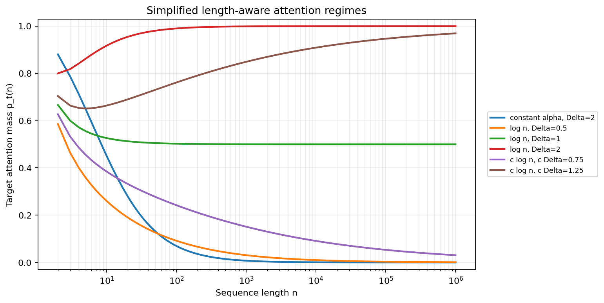
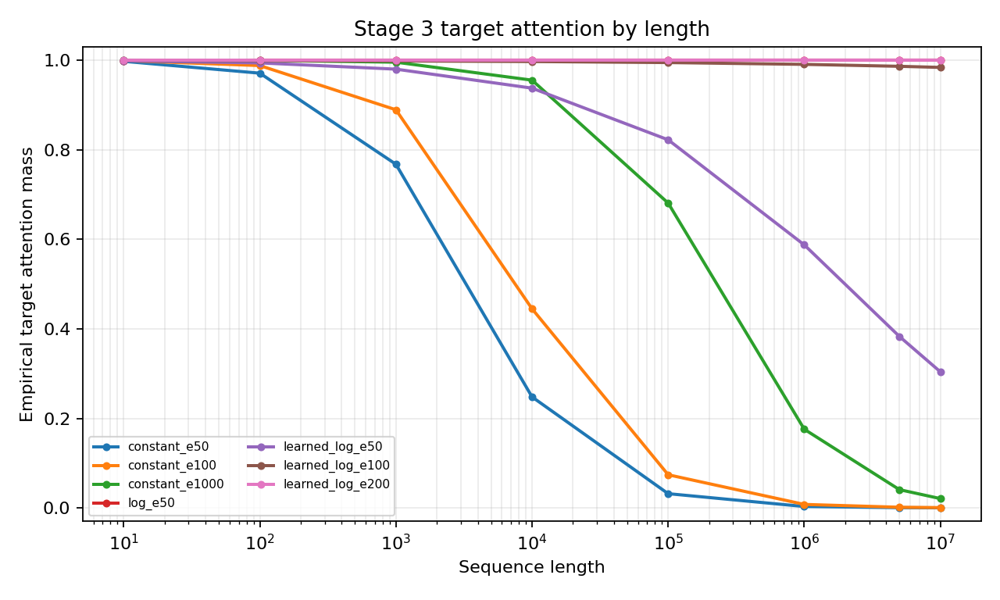
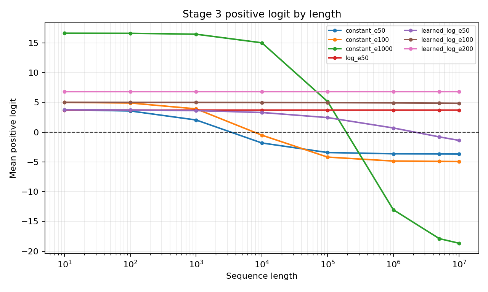

# Stage 3 Simplified Length-Aware Attention

## Objective

Stage 3 was motivated by the Stage 1 failure. A transformer trained only at length 10 learned a detector that worked near the training length, but its positive target evidence weakened at much longer lengths. To understand this failure in the simplest possible setting, the professor proposed a highly reduced attention model with one target key score $a$ and one shared non-target key score $b$.

I implemented this reduced model as a trainable architecture and tested whether it behaves according to the simplified theory.

The central question is:

**Can a trainable reduced attention model reproduce the theoretical length behavior predicted by the simplified model?**

The main answer is:

**Yes, in this reduced setting. The trained model satisfies the two-score assumption, so the closed-form attention equation applies. With enough optimization, learned-log attention can move from a finite-length regime into the asymptotic regime $c\Delta>1$.**

## Terminology: Two-Score Assumption

Throughout this document, the **two-score assumption** means:

```math
S_n=(a,b,b,\ldots,b).
```

Variables used here:

- $S_n$ is the attention score row used by the final classifier for a length-$n$ positive input.
- $a$ is the score assigned to the target key.
- $b$ is the shared score assigned to every non-target key.
- $\Delta=a-b$ is the target-vs-non-target score margin.

This assumption is the key condition behind the closed-form formula. If the model does not produce one target score and one shared non-target score, then the simplified formula is no longer an exact reduction of the full softmax.

## Theoretical Setup

Use a vocabulary with two tokens:

- $t$: target token
- $u$: non-target token

For sequence length $n$, the positive input is:

```text
t, u, u, ..., u
```

The negative input is:

```text
u, u, u, ..., u
```

Use fixed one-hot values:

```math
t \mapsto [1,0],
\qquad
u \mapsto [0,1].
```

For a positive input, the embedded matrix is:

```math
X_n =
\begin{bmatrix}
1 & 0 \\
0 & 1 \\
0 & 1 \\
\vdots & \vdots \\
0 & 1
\end{bmatrix}.
```

The simplified classifier reads only the output from the last query. Under the two-score assumption, the last-query score row is:

```math
S_n=(a,b,b,\ldots,b),
\qquad
a>b.
```

Before softmax, the model applies a score multiplier $\alpha$:

```math
\mathrm{softmax}(\alpha S_n).
```

Here, $\alpha$ means the multiplier used at the current sequence length $n$. It can be constant, fixed log-length, or learned log-length.

## Closed-Form Target Attention

The target attention mass is:

```math
p_t(n)
=
\frac{e^{\alpha a}}
{e^{\alpha a}+(n-1)e^{\alpha b}}.
```

Divide the numerator and denominator by $e^{\alpha b}$:

```math
p_t(n)
=
\frac{e^{\alpha(a-b)}}
{e^{\alpha(a-b)}+(n-1)}
=
\frac{e^{\alpha\Delta}}
{e^{\alpha\Delta}+(n-1)}.
```

This formula is not an independent model of attention. It is the full softmax rewritten under the two-score assumption.

The attention output after multiplying by $X_n$ is:

```math
\mathrm{softmax}(\alpha S_n)X_n
=
(p_t(n),1-p_t(n)).
```

The output is a convex combination of $[1,0]$ and $[0,1]$. Its coordinates always sum to 1.

## Limit Behavior

### Constant Multiplier

If:

```math
\alpha=\alpha_0,
```

then:

```math
p_t(n)
=
\frac{e^{\alpha_0\Delta}}
{e^{\alpha_0\Delta}+(n-1)}
\to 0
\qquad
\text{as } n\to\infty.
```

Interpretation:

A fixed target margin can beat each individual non-target token, but it cannot beat the total number of non-target keys as the softmax denominator grows.

### Log Multiplier

If:

```math
\alpha=\log n,
```

then:

```math
p_t(n)
=
\frac{n^\Delta}
{n^\Delta+n-1}.
```

Therefore:

```math
\Delta>1 \Rightarrow p_t(n)\to 1,
\qquad
\Delta=1 \Rightarrow p_t(n)\to \frac{1}{2},
\qquad
0<\Delta<1 \Rightarrow p_t(n)\to 0.
```

Interpretation:

A log multiplier is not automatically sufficient. It succeeds only if the score margin $\Delta$ is large enough.

### Scaled Log Multiplier

If:

```math
\alpha=c\log n,
```

then:

```math
p_t(n)
=
\frac{n^{c\Delta}}
{n^{c\Delta}+n-1}.
```

Therefore:

```math
c\Delta>1 \Rightarrow p_t(n)\to 1,
\qquad
c\Delta=1 \Rightarrow p_t(n)\to \frac{1}{2},
\qquad
c\Delta<1 \Rightarrow p_t(n)\to 0.
```

Interpretation:

The learned coefficient matters. A length-aware multiplier can still fail if the effective product $c\Delta$ is below the threshold.



## General Condition

Start from:

```math
p_t(n)
=
\frac{e^{\alpha\Delta}}
{e^{\alpha\Delta}+(n-1)}.
```

Divide the numerator and denominator by $e^{\alpha\Delta}$:

```math
p_t(n)
=
\frac{1}
{1+(n-1)e^{-\alpha\Delta}}.
```

Define the non-target-to-target softmax ratio:

```math
R_n=(n-1)e^{-\alpha\Delta}.
```

Then:

```math
p_t(n)=\frac{1}{1+R_n}.
```

Target attention converges to 1 exactly when the non-target-to-target ratio goes to 0:

```math
R_n\to 0.
```

Taking the log gives:

```math
\log R_n
=
\log(n-1)-\alpha\Delta.
```

For large $n$, $\log(n-1)$ grows like $\log n$. Therefore:

```math
p_t(n)\to 1
```

when:

```math
\alpha\Delta-\log n\to+\infty.
```

Interpretation:

The scaled target margin must grow faster than the logarithm of the number of competing non-target keys.

## Stage 3 Implementation

The implemented model is a minimal last-query attention classifier.

It uses:

- fixed one-hot token values $t\mapsto[1,0]$ and $u\mapsto[0,1]$
- learned query projection $W_Q$
- learned key projection $W_K$
- last-token query only
- softmax attention over all keys
- final linear classifier on the attention output

For input tokens, the model computes:

```math
Q=XW_Q,
\qquad
K=XW_K.
```

The last-query raw scores are:

```math
s_j
=
\frac{q_{\mathrm{last}}^\top k_j}{\sqrt{d_{\mathrm{head}}}}.
```

Then the score multiplier is applied:

```math
\tilde{s}_j=\alpha s_j.
```

The attention weights are:

```math
A_j
=
\frac{e^{\tilde{s}_j}}
{\sum_k e^{\tilde{s}_k}}.
```

The attention output is:

```math
o(n)=\sum_j A_j x_j.
```

Because $x_t=[1,0]$ and $x_u=[0,1]$, for a positive example:

```math
o(n)=(p_{\mathrm{emp}}(n),1-p_{\mathrm{emp}}(n)).
```

The final classifier is:

```math
z(n)=w^\top o(n)+b_{\mathrm{cls}}.
```

Variables used here:

- $z(n)$ is the final logit.
- $w$ is the learned classifier weight vector.
- $b_{\mathrm{cls}}$ is the learned classifier bias.
- positive examples are classified correctly when $z(n)\ge 0$.

The experiment tested three multiplier modes:

| Mode | Multiplier |
|---|---|
| `constant` | $\alpha=1$ |
| `log` | $\alpha=\log n$ |
| `learned_log` | $\alpha=1+c\log(1+n)$ |

For `learned_log`:

```math
c=\mathrm{softplus}(k_\alpha),
\qquad
\mathrm{softplus}(x)=\log(1+e^x).
```

The softplus function keeps $c$ positive while allowing optimization over an unconstrained parameter $k_\alpha$.

## Runs Analyzed

Analyzed run directories:

```text
runs/stage3_simplified_attention_constant_e50
runs/stage3_simplified_attention_constant_e100
runs/stage3_simplified_attention_constant_e1000
runs/stage3_simplified_attention_log_e50
runs/stage3_simplified_attention_learned_log_e50
runs/stage3_simplified_attention_learned_log_e100
runs/stage3_simplified_attention_learned_log_e200
```

All analyzed runs used:

- target token id: $t=0$
- non-target token id: $u=1$
- training length: 10
- training examples: 2000
- evaluation lengths up to 10,000,000

The run names encode training strength. For example, `e50` means 50 epochs.

## Assumption Validation

The important empirical check is not whether the closed-form formula matches the softmax after the assumption is true. That match is algebraic.

The important check is:

**Does the trained model satisfy the two-score assumption?**

The answer is yes. In every analyzed Stage 3 run, the non-target score standard deviation was 0.0 at every evaluated length.

| Run | Non-target score std | Max observed attention error | Two-score assumption holds? |
|---|---:|---:|---|
| `constant_e50` | 0.0 | about $2.5\times10^{-8}$ | yes |
| `constant_e100` | 0.0 | about $2.9\times10^{-8}$ | yes |
| `constant_e1000` | 0.0 | about $9.0\times10^{-7}$ | yes |
| `log_e50` | 0.0 | about $1.2\times10^{-7}$ | yes |
| `learned_log_e50` | 0.0 | about $1.4\times10^{-3}$ at 10M | yes |
| `learned_log_e100` | 0.0 | about $1.5\times10^{-5}$ at 10M | yes |
| `learned_log_e200` | 0.0 | about $1.2\times10^{-7}$ | yes |

Interpretation:

The trained reduced architecture satisfies the required score pattern: one target score $a$ and one shared non-target score $b$. Therefore the empirical target attention naturally follows the closed-form formula.

## Weight-Level Mechanism

The simplest model can be interpreted directly from its learned query and key projections. This section summarizes the mechanism; for the full step-by-step calculation from $W_Q$ and $W_K$ to $\Delta$, see `STAGE3_WEIGHT_LEVEL_MECHANISM.md`.

Because positive inputs always end with the non-target token $u$, the final query is:

```math
q_{\mathrm{last}}=q_u.
```

The target and non-target key vectors are:

```math
k_t=W_Kx_t,
\qquad
k_u=W_Kx_u.
```

The model creates $a>b$ when:

```math
\Delta
=
a-b
=
\frac{q_u^\top(k_t-k_u)}{\sqrt{d}}
>
0.
```

The mechanism is therefore simple: $q_u$ must align positively with the target-vs-non-target key difference $k_t-k_u$.

This raw margin is the same $\Delta$ that enters the target-attention formula:

```math
p_t(n)
=
\frac{e^{\alpha\Delta}}
{e^{\alpha\Delta}+(n-1)}.
```

For the rerun `learned_log_e200` checkpoint, the direct weight-level calculation produced:

| Quantity | Value |
|---|---:|
| $a=q_u^\top k_t/\sqrt{d}$ | 4.1900 |
| $b=q_u^\top k_u/\sqrt{d}$ | -4.1171 |
| $\Delta=a-b$ | 8.3072 |
| recorded `mean_delta` from the rerun | 8.3072 |

The component-wise margin decomposition was:

| Dimension | $q_u$ | $k_t-k_u$ | contribution to $\Delta$ |
|---:|---:|---:|---:|
| 0 | 2.1707 | 3.1037 | 4.7638 |
| 1 | 1.8260 | 2.7442 | 3.5433 |

Both dimensions contribute positively. The final non-target query points in a direction that strongly aligns with the target-minus-non-target key difference. This directly explains why the target key receives a larger raw score than the non-target key, producing the two-score pattern $S_n=(a,b,b,\ldots,b)$ with $a>b$.

## Overall Results

Negative examples were classified correctly in every analyzed run and length, so the table reports positive accuracy at length 10M.

| Run | Epochs | Approx. optimizer updates | $\Delta$ | Learned $c$ | $c\Delta$ | $p_{\mathrm{emp}}(10M)$ | Positive logit at 10M | Positive accuracy at 10M |
|---|---:|---:|---:|---:|---:|---:|---:|---:|
| `constant_e50` | 50 | 1600 | 8.1006 | n/a | n/a | 0.0003 | -3.6580 | 0.0000 |
| `constant_e100` | 100 | 3200 | 8.9883 | n/a | n/a | 0.0008 | -4.9271 | 0.0000 |
| `constant_e1000` | 1000 | 32000 | 12.2702 | n/a | n/a | 0.0209 | -18.6624 | 0.0000 |
| `log_e50` | 50 | 1600 | 3.9361 | n/a | n/a | 1.0000 | 3.7196 | 1.0000 |
| `learned_log_e50` | 50 | 1600 | 7.4085 | 0.0661 | 0.4894 | 0.3039 | -1.3771 | 0.0000 |
| `learned_log_e100` | 100 | 3200 | 7.9306 | 0.0961 | 0.7623 | 0.9837 | 4.8629 | 1.0000 |
| `learned_log_e200` | 200 | 6400 | 8.2994 | 0.1352 | 1.1218 | 1.0000 | 6.8194 | 1.0000 |





## Run-Level Interpretation

### Constant Multiplier

The constant multiplier runs use:

```math
\alpha=1.
```

The target attention mass is:

```math
p_t(n)
=
\frac{e^\Delta}
{e^\Delta+(n-1)}.
```

No matter how large training makes $\Delta$, if $\Delta$ is fixed, then:

```math
p_t(n)\to 0
\qquad
\text{as } n\to\infty.
```

Observed pattern:

- more training increases $\Delta$
- the failure point moves farther out
- long enough sequences still fail

| Run | $\Delta$ | Approx. target-attention classifier threshold | Estimated failure length | First observed failure window |
|---|---:|---:|---:|---|
| `constant_e50` | 8.1006 | 0.4909 | about 3.4K | 1K-10K |
| `constant_e100` | 8.9883 | 0.4946 | about 8.2K | 1K-10K |
| `constant_e1000` | 12.2702 | 0.5377 | about 183K | 100K-1M |

Summary:

**Constant multiplier learns a stronger finite-length solution with more training, not an asymptotically length-invariant solution.**

### Log Multiplier

The log multiplier run uses:

```math
\alpha=\log n.
```

The learned margin was:

```math
\Delta\approx3.9361.
```

Since $\Delta>1$, the simplified theory predicts:

```math
p_t(n)\to1
\qquad
\text{as } n\to\infty.
```

Observed behavior:

- target attention reached 1.0000 by long lengths
- positive logit stayed around 3.7196
- positive accuracy stayed 1.0000 through length 10M

Summary:

**The fixed log multiplier behaves as predicted: $\Delta>1$ gives asymptotically dominant target attention.**

### Learned-Log Multiplier

The learned-log runs use:

```math
\alpha=1+c\log(1+n).
```

For large $n$:

```math
\alpha\Delta-\log n
\approx
\Delta+(c\Delta-1)\log n.
```

Therefore the simplified asymptotic condition is:

```math
c\Delta>1.
```

The epoch sweep shows the transition:

| Run | $c\Delta$ | Status | Approximate failure length |
|---|---:|---|---:|
| `learned_log_e50` | 0.4894 | finite-length solution | about $2.1\times10^6$ |
| `learned_log_e100` | 0.7623 | stronger finite-length solution | about $3.4\times10^{14}$ |
| `learned_log_e200` | 1.1218 | asymptotic simplified-model solution | no finite asymptotic crossing |

Interpretation:

The 50-epoch learned-log run was undertrained. It learned $c\Delta<1$, so it was a finite-length solution and failed at 10M. The 100-epoch run was much stronger, but still had $c\Delta<1$, so the theory predicts eventual degradation at sufficiently larger lengths. The 200-epoch run crossed $c\Delta>1$, so it entered the asymptotic regime predicted by the simplified theory.

Summary:

**The learned-log model can learn the infinite-length solution in this reduced setting, but only after enough optimization pushes $c\Delta$ above 1.**

## Main Empirical Result

The main empirical result is not that the closed-form formula matches softmax. Once the two-score assumption holds, that agreement is expected.

The main empirical result is:

**The trained reduced architecture satisfies the two-score assumption, and sufficient optimization moves learned-log attention from $c\Delta<1$ to $c\Delta>1$.**

This means Stage 3 supports the professor's simplified analysis in the exact setting where the assumptions are enforced by the data structure and learned architecture.

## Stage 3B: Multi-Length Training Negative Result

Stage 3B tested whether multi-length training makes the learned-log model reach the asymptotic regime more quickly or more reliably. The hypothesis was that training on several lengths would create stronger pressure to increase the effective exponent:

```math
c\Delta.
```

The tested multi-length settings included short mixtures such as:

- $[10,20,50]$
- $[10,20,50,100]$

and broader log-spaced mixtures such as:

- $[10,100,1000]$
- $[10,100,1000,10000]$
- $[10,100,1000,10000,100000]$

The result was negative:

**Multi-length training did not help learned-log attention reach the asymptotic regime. Across broader training lengths and seed changes, the model increased the raw margin $\Delta$ but kept the learned log coefficient $c$ low, leaving $c\Delta<1$.**

Representative 6400-update results at evaluation length 10M:

The estimated failure length is a rough classifier-threshold estimate. Runs with $c\Delta>1$ have no finite asymptotic crossing under the simplified model.

| Training lengths | Seed | $c$ | $\Delta$ | $c\Delta$ | Positive logit at 10M | Positive accuracy at 10M | Estimated failure length |
|---|---:|---:|---:|---:|---:|---:|---:|
| $[10]$ | 42 | 0.1362 | 8.3072 | 1.1315 | 6.8062 | 1.0000 | no finite crossing |
| $[10,20,50]$ | 42 | 0.0778 | 9.1515 | 0.7124 | 6.7147 | 1.0000 | about $7.1\times10^{13}$ |
| $[10,20,50,100]$ | 42 | 0.0701 | 9.4509 | 0.6623 | 6.6312 | 1.0000 | about $1.5\times10^{12}$ |
| $[10,100,1000,10000,100000]$ | 42 | 0.0689 | 10.7430 | 0.7398 | 6.8771 | 1.0000 | about $1.0\times10^{18}$ |
| $[10,100,1000,10000,100000]$ | 123 | 0.0793 | 10.4889 | 0.8321 | 6.1681 | 1.0000 | about $1.8\times10^{27}$ |

The observed pattern was:

```math
\Delta \uparrow,
\qquad
c \downarrow,
\qquad
c\Delta<1.
```

This means multi-length training improved finite-length fitting, but it did not by itself create pressure to learn the asymptotic log correction. Even when the training set included length 100000, the model could still solve the finite supervised objective by increasing the raw margin $\Delta$ rather than learning a larger log coefficient $c$.

The most plausible interpretation for the multi-length result is:

- Adding longer training lengths increases pressure to solve larger finite denominators, but the optimizer appears to satisfy that pressure mainly by increasing $\Delta$ through the query/key projections.
- Multi-length training did not specifically encourage increasing $c$; in fact, broader length mixtures consistently learned lower $c$ than the single-length baseline at the same update budget.
- The finite BCE objective is still a finite-length objective. This is also true for single-length training, but Stage 3B shows that adding more finite lengths does not automatically turn the objective into an asymptotic one.
- A sufficiently large $\Delta$ remains a strong finite-length solution, even when the training distribution includes length 100000. This explains why multi-length runs can achieve high 10M logits while still staying below $c\Delta>1$.
- Because $c$ and $\Delta$ interact through their product, finite data can make multiple $(c,\Delta)$ combinations look similarly good. In these runs, multi-length optimization tended toward lower $c$ and higher $\Delta$.

Therefore:

**Stage 3B is evidence against the hypothesis that multi-length training alone makes the learned-log asymptotic regime easier to reach.**

## Stage 3C: Target Can Appear Anywhere

Stage 3C tested whether the reduced model still works when the target can appear at any non-final position. The final token was kept as the non-target token, so the readout query remained the non-target query.

The result was position-independent. Because the reduced model has no positional encoding, the target score depends on token identity rather than target position. Across target-position buckets, meaning coarse groups of examples where the target appears near the beginning, middle, or non-final end of the sequence, the non-target score standard deviation stayed at 0.0, $\Delta$ was stable up to numerical noise, and learned-log e200 still crossed the threshold:

```math
c\Delta \approx 1.1284 > 1.
```

The detailed Stage 3C analysis is in `STAGE3C_TARGET_ANYWHERE.md`.

## Connection To Stage 1

Stage 1 failed because positive target evidence weakened with length. The simplified model explains one possible mechanism:

```math
p_t(n)
=
\frac{e^{\mathrm{fixed\ target\ margin}}}
{e^{\mathrm{fixed\ target\ margin}}+(n-1)}.
```

Even if the target key has a higher score than each individual non-target key, the total non-target mass grows with sequence length. A model can therefore solve length 10 without learning a rule that remains valid at much longer lengths.

## Connection To Stage 2B

Stage 2B tried to fix the Stage 1 failure by making attention length-aware.

The Stage 3 result clarifies what such an intervention must achieve:

**It must create an effective target-vs-non-target margin that grows fast enough to beat the log-length denominator term.**

For a learned-log multiplier, the simplified threshold is:

```math
c\Delta>1.
```

However, this conclusion does not automatically transfer to the full Stage 2B transformer.

The full transformer can violate the simplified assumptions:

- non-target keys may not be identical
- target and non-target scores may vary across examples
- $\Delta$ may change with length
- max pooling can introduce additional non-target interference
- hidden-state dimensions can affect the classifier independently of target attention mass
- the classifier may not behave like a simple threshold on target attention

Therefore:

**Stage 3 proves that the length-aware mechanism can work when the two-score assumption holds. Stage 2B still requires separate analysis because the full transformer may fail to create or preserve that assumption.**

## Final Conclusion

Stage 3 starts from the professor's simplified model, implements it as a trainable reduced attention architecture, and checks whether the theory survives empirical training.

The result is:

**In the reduced setting, the trained model satisfies the two-score assumption required by the closed-form formula. Once that assumption holds, the decisive question becomes whether optimization reaches the correct asymptotic regime. Constant multiplier cannot do so; fixed log multiplier succeeds when $\Delta>1$; learned-log multiplier succeeds once training pushes $c\Delta>1$. Stage 3B shows that multi-length training alone does not reliably create that pressure.**

This is useful groundwork for the full transformer experiments because it separates two problems:

- Can the architecture produce the required target-vs-non-target score pattern?
- Can the length-aware mechanism make the effective margin grow fast enough?

## Limitations And Next Steps

Recommended follow-up work:

- Test learned embeddings instead of fixed one-hot values.
- Move the target position away from index 0.
- Add controlled fixed-$c$ experiments for $c\Delta<1$, $c\Delta=1$, and $c\Delta>1$.
- Compare the Stage 3 $c\Delta$ threshold with the effective margin behavior in Stage 2B target-key log-bias runs.
- Analyze whether the full transformer can create the same shared non-target score pattern without the reduced setup.
- If revisiting Stage 3B, test explicit regularization or objective terms that reward $c\Delta>1$ rather than only finite-length classification accuracy.
