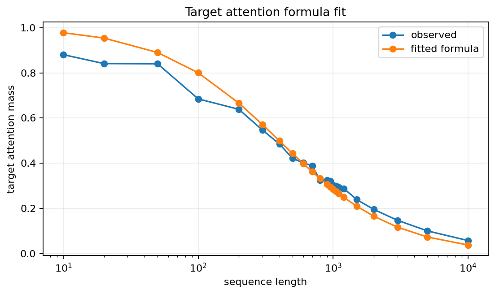
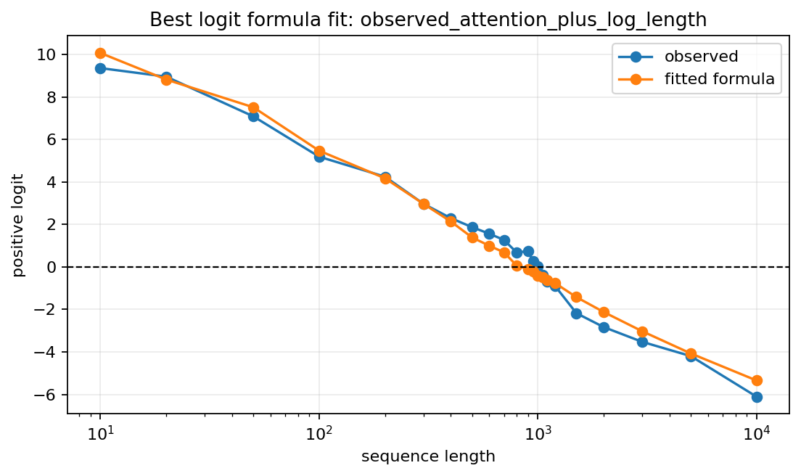
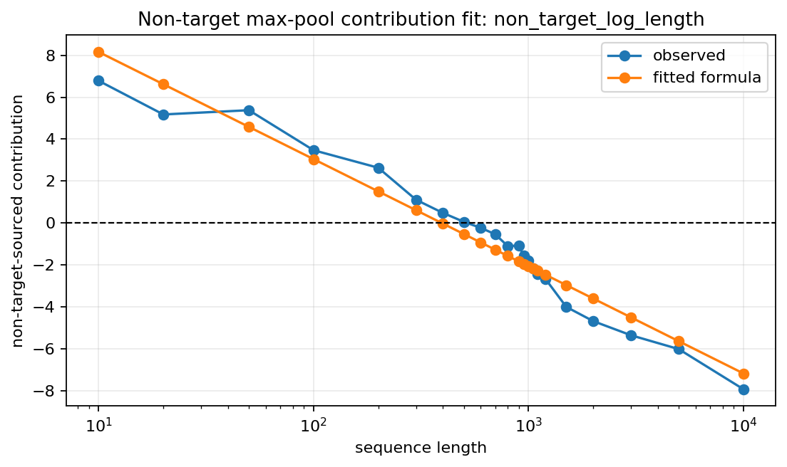
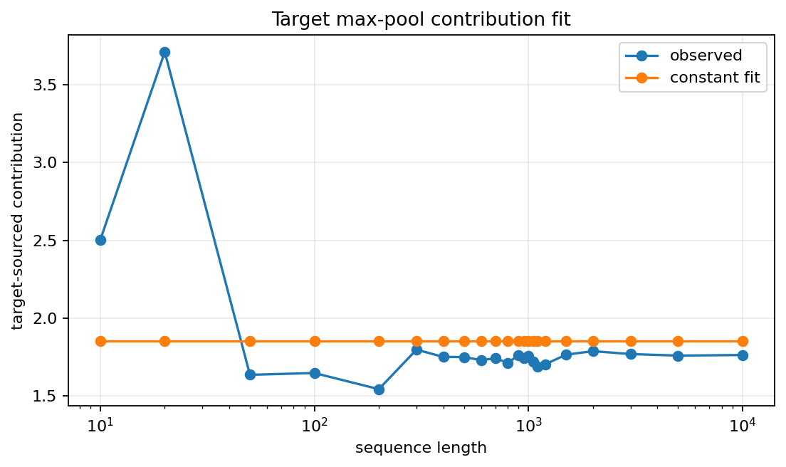

# Reduced Theoretical Model for Stage 1 Length Failure

## Objective

This document defines a reduced mathematical model for the Stage 1 transformer failure on long exactly-one positive sequences.

The goal is not to reproduce every internal activation of the trained transformer. The goal is to write a small formula that captures the main empirical pattern observed in `STAGE1_NUMERICAL_ANALYSIS.md`:

- target attention mass decreases as sequence length grows
- non-target interference increases with sequence length
- the final positive logit eventually crosses below zero

## High-Level Decomposition

We model the final classifier logit as the sum of three terms:

```math
L(n)
\approx
b_0
+
T(n)
-
U(n)
```

Notation used here:

- $n$ is the sequence length.
- $L(n)$ is the final classifier logit at length $n$.
- $b_0$ is the classifier-bias term.
- $T(n)$ is the positive target-signal contribution.
- $U(n)$ is the non-target interference contribution.

The intended interpretation is:

```math
T(n)
\text{ decreases or saturates as length grows}
```

while:

```math
U(n)
\text{ increases as length grows}
```

The Stage 1 model fails when:

```math
L(n) < 0
```

because the binary decision rule is:

```math
\mathrm{prediction}
=
\begin{cases}
\mathrm{positive}, & L(n) \ge 0 \\
\mathrm{negative}, & L(n) < 0
\end{cases}
```

## Target Attention Mass

For one query position, define $s_t$ as the attention score assigned to the target key. Define $\mu_u$ as the average exponentiated score assigned to non-target keys:

```math
\mu_u
=
\mathbb{E}_{u}[e^{s_u}]
```

Notation used here:

- $s_t$ is the target attention score.
- $s_u$ is a non-target attention score.
- $\mu_u$ is the mean exponentiated non-target score.

The approximate attention mass on the target key is:

```math
A(n)
=
\frac{
e^{s_t}
}{
e^{s_t}
+
(n - 1)
\mu_u
}
```

Notation reminder:

- $A(n)$ is the target attention mass at sequence length $n$.
- $n-1$ is the number of non-target tokens in an exactly-one-target positive sequence.

This formula captures the softmax denominator effect. The target numerator may remain large, but the denominator grows as more non-target keys are added.

## Score Margin Form

Define the fixed target score margin:

```math
m
=
s_t
-
\log \mu_u
```

Then the target attention mass can be rewritten as:

```math
A(n)
=
\frac{
1
}{
1
+
(n - 1)
e^{-m}
}
```

Notation reminder:

- $m$ is the effective target score margin.
- $\log \mu_u$ is the effective non-target score induced by the softmax denominator.
- $A(n)$ is the target attention mass at length $n$.

This is the core length-scaling formula. If $m$ is fixed, then $A(n)$ decreases as $n$ increases.

## Required Margin for Length Generalization

To keep the target attention mass roughly constant as length grows, the effective margin $m$ must grow with length.

A rough condition is:

```math
m
\gtrsim
\log n
```

For example:

```math
\log(10) \approx 2.3
```

while:

```math
\log(1000) \approx 6.9
```

Therefore, a margin that is sufficient for length 10 can be insufficient for length 1000.

This is a plausible reason why the Stage 1 transformer succeeds on length-10 training examples but fails on much longer positive examples. Length-10 training does not strongly pressure the model to learn the much larger margin needed for long-sequence extrapolation.

## Final Logit Model

Attention dilution alone does not fully describe the final classifier output, because the Stage 1 model uses max pooling before the classifier.

The reduced logit model is:

```math
L(n)
\approx
b_0
+
\gamma
\cdot
A(n)
-
\lambda
\cdot
g(n)
```

Notation used here:

- $n$ is the sequence length.
- $L(n)$ is the final classifier logit at length $n$.
- $b_0$ is the fitted classifier-bias term.
- $A(n)$ is the target attention mass at length $n$.
- $\gamma$ is the fitted strength converting target attention mass into positive classifier evidence.
- $g(n)$ is the candidate length-dependent non-target interference growth function.
- $\lambda$ is the fitted strength of the non-target interference term.

## Candidate Non-Target Interference Functions

The empirical analysis showed that target-sourced max-pool contribution stays relatively stable at long lengths, while non-target-sourced contribution becomes increasingly negative.

One simple candidate is logarithmic growth:

```math
g(n)
=
\log n
```

Another candidate comes from the intuition that max pooling over many non-target positions creates an extreme-value effect:

```math
g(n)
=
\sqrt{2\log n}
```

Both should be treated as candidate reduced models. The next step is to fit each candidate to the empirical length sweep and compare predicted logits against observed logits.

## Complete Reduced Formula

The complete candidate model is:

```math
A(n)
=
\frac{
1
}{
1
+
(n - 1)
e^{-m}
}
```

and:

```math
L(n)
\approx
b_0
+
\gamma
\cdot
A(n)
-
\lambda
\cdot
g(n)
```

Notation reminder:

- $m$ is the fitted target score margin.
- $A(n)$ is the predicted target attention mass.
- $L(n)$ is the predicted final logit.
- $b_0$ is the fitted classifier-bias term.
- $\gamma$ is the fitted target-signal strength.
- $\lambda$ is the fitted non-target-interference strength.
- $g(n)$ is the chosen non-target-interference growth function.

The main model-selection choice is:

```math
g(n)
\in
\left\{
\log n,
\sqrt{2\log n}
\right\}
```

## Interpretation

This reduced model explains the empirical failure as:

```math
\mathrm{sequence\_length} \uparrow
\quad\Rightarrow\quad
\mathrm{softmax\_denominator} \uparrow
\quad\Rightarrow\quad
\mathrm{target\_attention\_mass} \downarrow
```

and:

```math
\mathrm{sequence\_length} \uparrow
\quad\Rightarrow\quad
\mathrm{non\_target\_interference\_growth} \uparrow
\quad\Rightarrow\quad
\mathrm{negative\_classifier\_contribution} \uparrow
```

Together:

```math
L(n) \downarrow
```

The Stage 1 transformer therefore appears to learn a finite-margin target-detection mechanism rather than a true length-invariant existential algorithm.

## Empirical Fit Results

The formula was fit to the extended Stage 1 length sweep in:

```text
runs/stage1_transformer_maxpool2/numerical_analysis/theoretical_fit
```

The evaluated lengths were:

```text
10, 20, 50, 100, 200, 300, 400, 500, 600, 700, 800, 900,
950, 1000, 1050, 1100, 1200, 1500, 2000, 3000, 5000, 10000
```

### How The Fit Was Performed

The fitting pipeline estimates a small number of reduced-model parameters from the observed Stage 1 length sweep. The goal is not to exactly reproduce every transformer activation. The goal is to find a simple formula that closely matches the observed attention, logit, and max-pool contribution curves.

For the attention fit, the only fitted parameter is:

```math
m
```

The code chooses this value by minimizing the sum of squared errors between observed target attention mass and the fixed-margin formula:

```math
\sum_i
\left(
A_{\mathrm{obs}}(n_i)
-
\hat{A}(n_i)
\right)^2
```

The predicted attention is:

```math
\hat{A}(n)
=
\frac{
1
}{
1
+
(n-1)e^{-m}
}
```

Notation used here:

- $m$ is the fitted target score margin.
- $A_{\mathrm{obs}}(n_i)$ is the observed target attention mass at length $n_i$.
- $\hat{A}(n_i)$ is the formula-predicted target attention mass at length $n_i$.
- $i$ indexes the evaluated sequence lengths.

This one-parameter nonlinear fit is solved by golden-section search over candidate margin values.

For the final-logit fit, the code uses ordinary least squares. Candidate formulas have the form:

```math
\hat{L}(n)
=
b_0
+
\gamma
\cdot
A(n)
-
\lambda
\cdot
g(n)
```

where:

- $\hat{L}(n)$ is the formula-predicted logit at length $n$.
- $b_0$ is the fitted intercept.
- $\gamma$ is the fitted strength of target attention evidence.
- $A(n)$ is the target attention mass used by the logit model.
- $\lambda$ is the fitted strength of non-target interference.
- $g(n)$ is a candidate length-growth function, such as $\log n$ or $\sqrt{2\log n}$.

For the max-pool contribution fit, the code separately fits the measured target-sourced and non-target-sourced contribution curves from `maxpool_source_summary.csv`. The non-target models use ordinary least squares formulas such as:

```math
C_{\mathrm{non\_target}}(n)
\approx
a
-
c
\log n
```

R-squared is not the quantity directly optimized. The code minimizes squared error first, then reports R-squared, mean absolute error, and root mean squared error as fit-quality metrics.

### Attention Fit

The best reduced attention formula was:

```math
A(n)
=
\frac{
1
}{
1
+
(n - 1)
e^{-5.9855}
}
```

Notation reminder:

- $A(n)$ is the fitted target attention mass at length $n$.
- $5.9855$ is the fitted target score margin $m$.

Fit result:

| Metric | Value |
|---|---:|
| R-squared | 0.9586 |
| mean absolute error | 0.0360 |
| root mean squared error | 0.0472 |



This supports the fixed-margin interpretation. The learned effective margin is enough for short sequences, but it is smaller than the rough margin needed at long lengths:

```math
\log(1000) \approx 6.91
```

```math
\log(10000) \approx 9.21
```

### Final Logit Fit

The best reduced logit formula was:

```math
L(n)
\approx
7.2765
+
6.8618
\cdot
A_{\mathrm{obs}}(n)
-
1.4136
\cdot
\log n
```

Notation reminder:

- $L(n)$ is the fitted final logit at length $n$.
- $A_{\mathrm{obs}}(n)$ is the observed target attention mass at length $n$.
- $7.2765$ is the fitted intercept $b_0$.
- $6.8618$ is the fitted target-signal coefficient $\gamma$.
- $1.4136$ is the fitted non-target-interference coefficient $\lambda$ for $g(n)=\log n$.

Fit result:

| Quantity | Value |
|---|---:|
| R-squared | 0.9846 |
| mean absolute error | 0.4099 |
| root mean squared error | 0.4861 |



This means that target attention decay alone is not the full explanation. The final logit is better explained by combining positive target evidence with a length-growing non-target penalty.

### Max-Pool Contribution Fit

The measured non-target-sourced max-pool contribution is also well fit by a logarithmic length penalty:

```math
C_{\mathrm{non\_target}}(n)
\approx
13.2757
-
2.2212
\cdot
\log n
```

Notation reminder:

- $C_{\mathrm{non\_target}}(n)$ is the measured non-target-sourced max-pool contribution at length $n$.
- $13.2757$ is the fitted intercept.
- $2.2212$ is the fitted log-length penalty coefficient.

Fit result:

| Model | R-squared | RMSE |
|---|---:|---:|
| non-target constant | 0.0000 | 3.7056 |
| non-target log(sequence_length) | 0.9579 | 0.7606 |
| non-target sqrt(2 log(sequence_length)) | 0.9174 | 1.0648 |



This supports the interpretation that the log-length penalty in the final-logit formula corresponds to a real max-pool interference effect, not just an arbitrary curve fit.

The target-sourced contribution is comparatively stable but not exactly constant:

| Model | RMSE |
|---|---:|
| target constant | 0.4395 |



Therefore, the safer statement is:

```text
Target-sourced contribution changes much less than non-target-sourced contribution,
but it should not be treated as perfectly constant.
```

## Current Conclusion

The extended fit supports the reduced explanation:

- fixed target score margin
- softmax denominator growth
- length-growing non-target interference

More concretely:

```math
A(n)
\text{ is explained by fixed-margin softmax dilution}
```

and:

```math
L(n)
\text{ is explained by target evidence minus a logarithmic non-target max-pool penalty}
```

This is a close quantitative reproduction of the empirical Stage 1 failure curve, although it remains a reduced model rather than a full exact model of every transformer activation.
